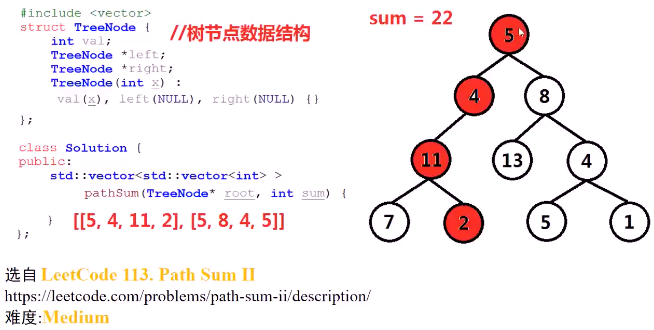
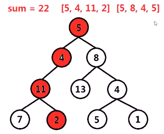
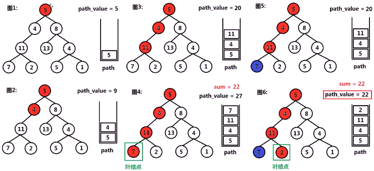
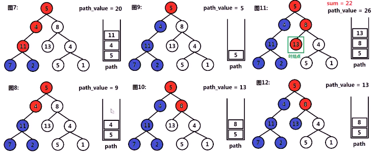
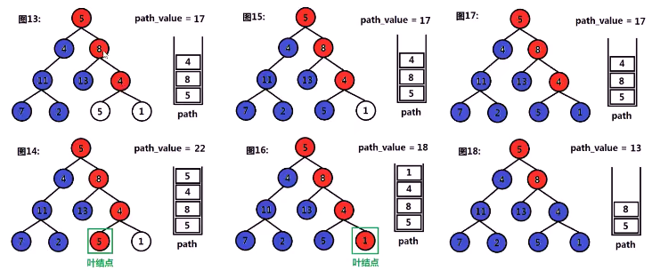
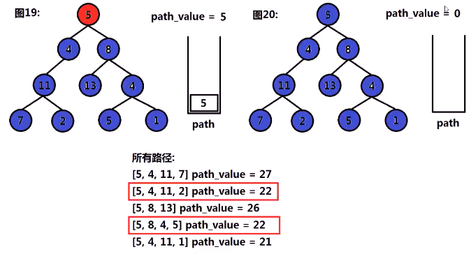
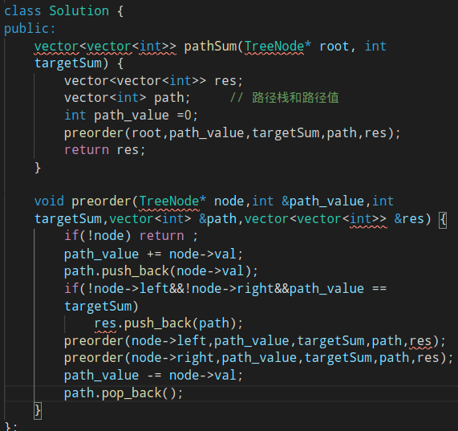

#### 给定二叉树与整数sum，找出所有从根节点到叶节点的路径，这些路径上的节点值累加和为sum

* 
* 思考
  * 深搜所有从**根节点**到**叶节点**的**路径**，检查**各路径**上所有节点的**值的和**是否为sum
  * 
    * 何种数据结构**存储** 遍历路径上的**节点**
    * 在树的**前序遍历**时做什么？**后序遍历**时做什么？
    * 如何判断一个**叶节点**？当遍历到叶节点时应该做什么？
* 算法思路
  * 从根节点**深度遍历**（先序、中序和后序中任意一种都是）二叉树，**先序遍历**时，将该节点值存储到**path栈**中（vector实现），使用path_value**累加**节点值
  * 当遍历到**叶节点**时，检查**path_value值**是否为sum，若为sum，则将path **push进入**result中
  * 在**后序遍历**中，将该节点值从path栈中**弹出**，path_value**减去**节点值（回溯）
  * 
  * 
  * 
  * 

* 代码实现
  * 
  * 

