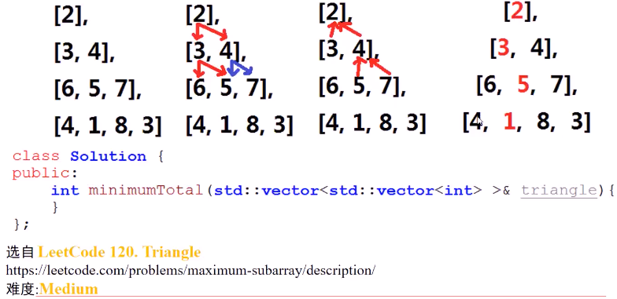

#### 二维数组保存数字三角形，从**顶端到底**各数字**和最小**的路径之和，每次可以向下走**相邻**的两个位置

* 
* 思考
  * **从上往下**和**从下到上**的寻找路径的**思考方式**本质一致？
  * dp [i] [j] 代表三角形第i行、第j列的最优解，从上到下和从下到上哪种方式**递推更容易**？（更少的**边界条件**）
    * 
    * 递推分析
    * 
    * 
    * 从下往上推只需要考虑上方位置
* 实现思路

> 1. 设置二维数组，**最优值三角形**dp [] [] ，并初始化数组元素为0。dp[i] [j]代表从底向上递推，走到三角形第i行第j列的最优解
> 2. 从三角形的**底部**向三角形上方进行dp
>    1. 动态规划边界条件：底部上的最优值为数字三角形的**最后一层**
>    2. 利用i循环，从倒数第二层递推到第一层，对于每层的各列，进行dp递推
>       1. 第i行，第j列的最优解为dp[i] [j]，可到达(i,j)的两个位置最优值为dp[i+1] [j] 、dp[i+1] [j+1]。dp[i] [j] = min(dp[i+1] [j],dp[i+1] [j+1]) +triangle[i] [j]
> 3. 返回dp[0] [0]

* 代码实现
  * 
  * 