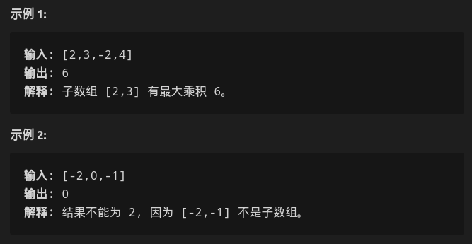

#### 给你一个整数数组 `nums` ，请你找出数组中乘积最大的连续子数组（该子数组中至少包含一个数字），并返回该子数组所对应的乘积。

* 

* 思路

  * 看到连续，想到用滑动窗口

    * ```c++
          //子数组要求连续 ==> 滑动窗口
          //[0,2]无法解决
          int maxProduct(vector<int>& nums) {
              if(nums.size() == 0) return 0;
              if(nums.size() == 1) return nums[0];
              int begin = 0;
              int max_ = nums[begin];
              for(int i=1;i<nums.size();) {
                  if(max_*nums[i] >= max_) {
                      max_ = max(max_,multiply(nums,begin,i));
                      i++;
                  }
                  else {
                      begin = i;
                      i = begin+1;
                  }
              }
              return max_;
          }
      
       	int multiply(vector<int> &nums,int begin,int i) {
              int tmp = 1;
              for(int j =begin;j<=i;j++) {
                  tmp *= nums[j];
              }
              return tmp;
          }
      ```

    * 该方法无法处理含有零的情况，此时感觉要分类分析

  * 考虑题目给出的`dp`

    * ```c++
      // dp[i]代表以i位置为结束的子数组最大乘积
          // [-2,3,-4] 无法考虑到
          // 2^3 = 8中选择，而不是在以nums[n-1]结尾中选最大的
          // 这里的dp[i]定义出问题
          int maxProduct(vector<int>& nums) {
              vector<int> dp(nums.size(),0);
              // base case 
              dp[0] = nums[0];
      
              for(int i=1;i<nums.size();++i) {
                  dp[i] = max(dp[i-1]*nums[i],nums[i]);
              }
      
              // return dp[nums.size()-1];
              // 应该返回dp数组中最大元素
              int max_ = dp[0];
              for(int i=1;i<dp.size();++i) {
                  if(dp[i] > max_)
                      max_ = dp[i];
              }
              return max_;
          }
      
          // dp[i]表示范围以i结尾的子数组乘积中最大值
          // 这里状态之间没找到转换的公式
          // 放弃dp
          int maxProduct(vector<int>& nums) {
              vector<int> dp(nums.size(),0);
              // base case 
              dp[0] = nums[0];
      
              for(int i=1;i<nums.size();++i) {
                  dp[i] = max(dp[i-1]*nums[i],dp[i-1]);
              }
      
              return dp[nums.size()-1];
      
          }
      ```

  * 此时发现`dp`无法连接两个状态

    * > 首先假设存在某个最大乘积，然后对数组遍历，在经过每个元素的时候，有以下四种情况：
      >
      > - 如果该元素为正数：
      >   - 如果到上一个元素为止的最大乘积也是正数，那么直接乘上就好了，同样的最大乘积也会变得更大
      >   - 如果到上一个元素为止的最大乘积是负数，那么最大乘积就会变成该元素本身，且连续性被断掉
      > - 如果该元素为负数：
      >   - 如果到上一个元素为止的最大乘积也是负数，那么直接乘上就好了，同样的最大乘积也会变得更大
      >   - 如果到上一个元素为止的最大乘积是正数，那么最大乘积就会不变，且连续性被断掉
      >
      > 以上四种情况中说到的最大乘积都是临时最大乘积，每遍历新的元素都需要进行比较来确定真正的最大乘积。
      >
      > 如果细心的话就可以发现，如果要得到乘以当前元素以后的最大乘积，需要记录最大乘积，也要记录最小乘积，因为最小值可能翻身变最大值。

    * ```c++
      	// 类似最大子列和 在线处理
          int maxProduct(vector<int>& nums) {
              int n=nums.size();
              int ans = INT_MIN;
              int max_v = 1,min_v=1;
              for(int i=0;i<n;i++){
                  if(nums[i] <0) swap(max_v,min_v);
                  max_v = max(max_v*nums[i],nums[i]);
                  min_v = min(min_v*nums[i],nums[i]);
                  ans = max(max_v,ans);
              }
              return ans;
          }
      ```

    * 

