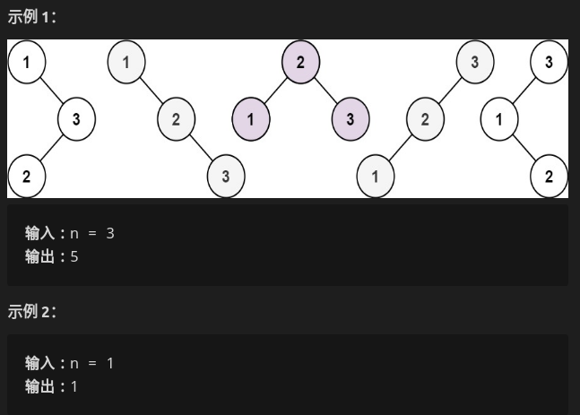
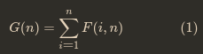
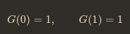
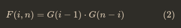
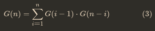

##### 给你一个整数 `n` ，求恰由 `n` 个节点组成且节点值从 `1` 到 `n` 互不相同的 **二叉搜索树** 有多少种？返回满足题意的二叉搜索树的种数。

* 

* 思考

  * 给定一个1...n的序列，构建出一颗**二叉排序树**
    * 遍历每一个数字i，将其作为树根，**将1...(i-1)作为左子树**，**（i+1）...n作为右子树**
  * 考虑用一维dp，dp[i]代表是什么？
    * 假设n个节点存在二叉排序树的个数是G(n)
    * f(i，n)是**以i为根**，**序列长度为n**的二叉搜索树的个数
      * 就有 
    * 对于边界条件：当序列长度为 1（只有根）或为 0（空树）时，只有一种情况
      * 
    * 给定序列[1,n]，选择数字i为根，根为i的所有二叉搜索树的集合是左子树集合和右子树集合的**笛卡尔积**（所有组合）
      * 举例而言，创建以 3 为根、长度为 7 的不同二叉搜索树，整个序列是 [1, 2, 3, 4, 5, 6, 7][1,2,3,4,5,6,7]，我们需要从左子序列 [1, 2][1,2] 构建左子树，从右子序列 [4, 5, 6, 7][4,5,6,7] 构建右子树，然后将它们组合（即笛卡尔积）
      * 不同搜索树的个数为f(3,7)，将[1,2]构建不同左子树的数目为G（2），从[4,5,6,7]构建不同右子树的数为G（4）。G（n）与序列内容无关，只与序列长度有关。
      * f(3,7) = G(2) * G(4)
      * 于是有公式
    * 结合两个公式，得到G(n)的递归表达式
      * 
    * 之后就是从大到小遍历G数组即可

* 代码实现

  * ```c++
    int numTrees(int n) {
        vector<int> G(n+1,0);
        G[0] = 1;
        G[1] = 1;
    
        for(int i=2;i<=n;++i)
            for(int j=1;j<=i;++j)
                G[i] += G[j-1] * G[i-j];
        return G[n];
    }
    ```

  * 

