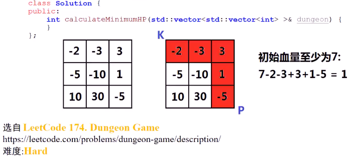

#### **二维数组**，左上角代表骑士位置，右下角为公主的位置，数组存储整数，正数加血，负数扣血，问骑士初始情况至少需要多少生命值，才能保证骑士行走过程中至少保持生命值为1（骑士只能向下或向右行走）

* 

* 思考

  * 每个格子代表什么
  * 从右下角开始往前走（至少）
    * 
    * 若从左上到右下
      * 每个格子**最多获得血量**，dp[i] [j] 代表骑士在位置(i,j)能**积累**的最大血量，能否转换成**初始时**至少是多少血量
    * 从右下到左上
      * 格子代表什么
      * 要到达右下角，至少有多少血量，能在行走的过程中至少保持生命值1
      * 

* 算法思路

  * > 1. 边界处理
    >    1. 1xn，i从n-2到0
    >       1. dp[0] [i] = max(1,dp[0] [i+1] - dungeon[0] [i])
    >    2. nx1，i从n-2到0
    >       1. dp[i] [0] = max(1,dp[i+1] [0] - dungeon[i] [0])
    >    3. 
    > 2. 整体思路
    >    1. 

* 代码实现
  * 
  * 