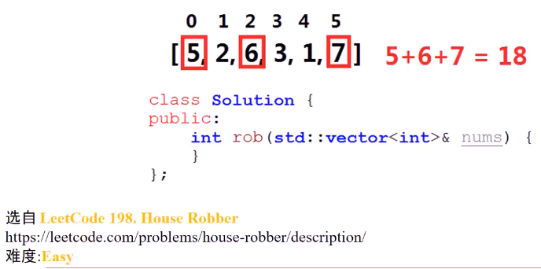
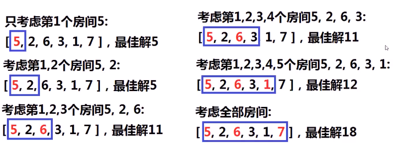
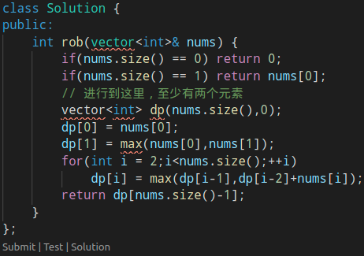
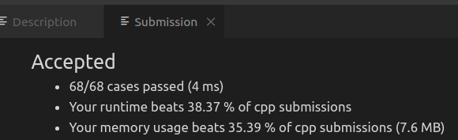

#### 问题描述

> **一条直线**，n个房子，每个房子有**数量不等**的财宝，一个盗贼，不能从相邻两个房屋中偷东西。**最多**可以获取多少财宝？

* 
* 思考
  * n个房间，都有盗取/不盗取两种可能，类似求子集（暴力搜索）方法，选择总和最大的子集，最多2^n个可能

  * 贪心。满足条件情况下，每次选择财宝最大的房间

  * 考虑dp，怎么确定原问题和子问题、状态、边界状态、状态转移方程

    * 
    * 分析第i个房间的情况
      * 若选择第i个房间，那么不能选择第i-1个房间，此时结果等于dp[i] = dp[i-2] + w[i]
      * 若不选择第i个房间，相当与只考虑前i-1个房间 dp[i] = dp[i-1]
      * 对以上两个情况求一个max就得出结果

  * > 1. 确认原问题和子问题
    >    1. **原问题**是n个房间的最优解，**子问题**是求前1个房间、前2个房间、... 、前n-1个房间的最优解
    > 2. 确认状态
    >    1. 第i个状态是**前i个房间**能够获得的最大财宝（最优解）
    > 3. 确认边界状态的值
    >    1. **前1个房间**的最优解，第一个房间的值
    >    2. **前2个房间**的最优解，第1、2个房间中较大财宝的
    > 4. 确定状态转移方程
    >    1. **选择**第i个房间：第i个房间+前i-2个房间的最优解
    >    2. **不选择**第i个房间：前i-1个房间的最优解
    >    3. 状态转移方程
    >       1. dp[i] = max(dp[i-1],dp[i-2] + nums[i]); (i>=3)

* 代码实现
  * 
  * 

