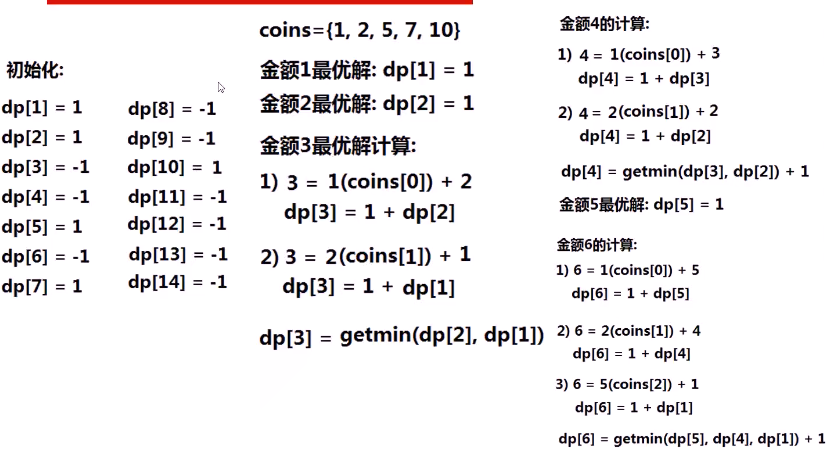

#### 有**不同面值**的钞票，如何用**最少数量**的钞票组成**某个金额**，求可以使用的最少钞票数量。无法满足，返回-1

* 

* 思考

  * 贪心不行 

    * > 面值[1,2,5,10]，金额14，**最优解**需要3张
      >
      > **贪心思想**：每次**优先使用面值最大**的钞票
      >
      > 先选一张10块，剩下4元；再选1张2块，剩下2元；再选一张2元，**搞定**
      >
      > 面值[1,2,5,7,10]，金额14，**最优解**需要2张7元
      >
      > **贪心思想**：先选一张10元，剩下4元；再选一张2元的，剩下2元；再选一张2元的，**错了**

    * 贪心在**个别面值组合**的时候可以，如日常生活中的RMB面值，但是本体面值不确定，不可以使用贪心

  * 动态规划 

    * > **面值**[1,2,5,7,10]，**金额**14
      >
      > dp[i]代表什么？i代表什么？
      >
      > dp[i]表示**金额i**的最优解（即最小使用张数）
      >
      > dp数组存储金额1-14的最优解（最少使用张数）
      >
      > ### 讨论第i个状态
      >
      > dp[0]、dp[1]、...、dp[i-1]都是已知的
      >
      > **金额i**可以由：
      >
      > 金额i-1与coins[0] （1）组合
      >
      > 金额i-2与coins[1]（2）组合
      >
      > 金额i-5与coins[2]（5）组合
      >
      > 金额i-7与coins[3]（7）组合
      >
      > 金额i-10与coins[4]（10）组合
      >
      > **状态i**可以由i-1、i-2、i-5、i-7和i-10这5个**状态转移到**
      >
      > dp[i] = min(dp[i-1],dp[i-2],dp[i-5],dp[i-7],dp[i-10]) +1
      >
      > 类似青蛙跳
      >
      > 上面dp[i]可以由5个地方到达
      >
      > 时间复杂度为amount*len(coins)
      >
      > 空间复杂度amount

  * 算法思路
    * 
    * 

* 代码实现

  * 
  * 

