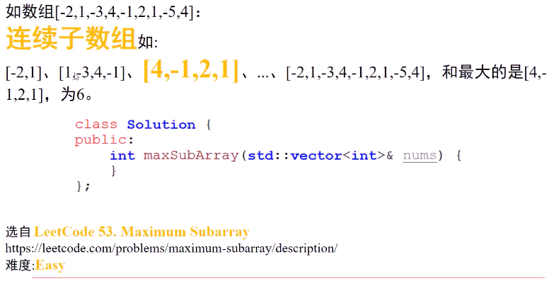
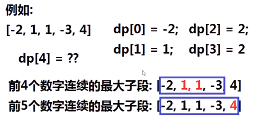
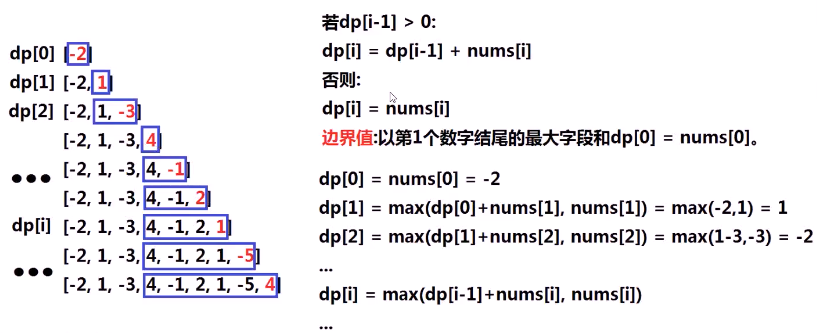
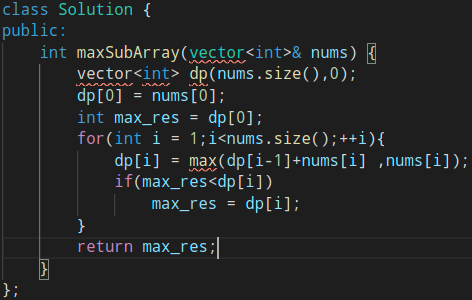
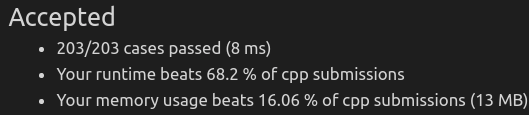

#### 求数组的连续子数组中，最大的一段的和

* 

* 思考

  * 枚举所有字段的和，复杂度

  * 尝试dp，最关键是确认**动态规划状态**，假设第i个状态dp[i]表示**前i个数字**组成的连续最大字段和，能否**推导出**dp[i]与dp[i-1]的关系

    * 不能通过dp[i-1]、dp[i-2]、... 、dp[0]推出dp[i]

    * 

    * 两者并不相邻，无法构成连续子数组，没有内在联系，无法进行推导

    * 让**第i个状态**的最优解和**第i-1个状态**的最优解产生**直接联系**

      * 设计状态，让其联系

      * 第i个状态dp[i]代表**以第i个数字结尾**的最大字段和，那么dp[i] 和dp[i-1]之间**关系**是什么

        * > 以第i-1个数字结尾的最大字段和dp[i-1]与nums[i]相邻
          >
          > 
          >
          > dp[i] = max(dp[i-1]+nums[i],nums[i]);
          >
          > 以第i个元素结尾的最大字段和，第一个情况是还连着，第二个情况是已经断开但还是以第i个元素结尾。在每次循环中更新最大字段和（最终结果是求dp[0]到dp[n-1]最大的数，这里做了一个选择排序）

* 代码实现
  * 
  * 