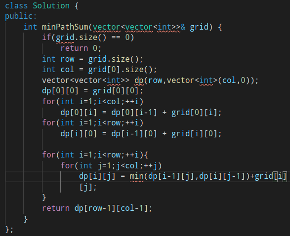
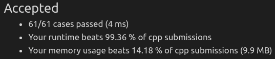

##### 最小路径和

> 已知一个**二维数组**，存储**非负整数**，找到从**左上角**到**右下角**的一条路径，使得路径上的**和最小**
>
> 只能向下和向右移动

* 

* 最重要就是设计状态 dp[i] [j]    到达位置(i,j)的最优解（最小值）

  * dp[i] [j]与dp[i-1] [j]、dp[i] [j-1]、grid[i] [j] 之间的关系
  * 边界条件
  * 
    * dp[i] [j] = min(dp[i-1] [j],dp[i] [j-1]) + grid[i] [j]
    * 边界 == 上边＆左边
      * 可以先算出来，其最优值只能由一个方向得到

* 代码实现

  * 

  * 

    

