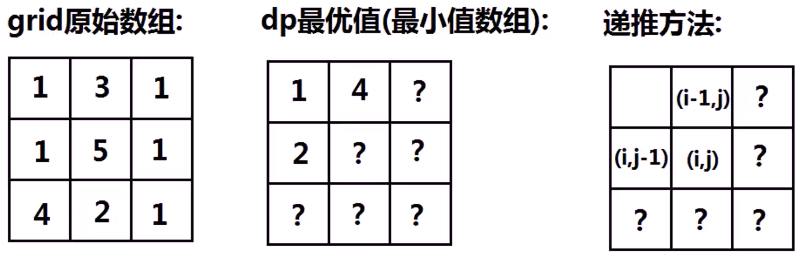

##### 最小路径和

> 已知一个**二维数组**，存储**非负整数**，找到从**左上角**到**右下角**的一条路径，使得路径上的**和最小**
>
> 只能向下和向右移动

* 
* 最重要就是设计状态 dp[i] [j]    到达位置(i,j)的最优解（最小值）

  * dp[i] [j]与dp[i-1] [j]、dp[i] [j-1]、grid[i] [j] 之间的关系
  * 边界条件
  * 
    * dp[i] [j] = min(dp[i-1] [j],dp[i] [j-1]) + grid[i] [j]
    * 边界 == 上边＆左边
      * 可以先算出来，其最优值只能由一个方向得到

## 思路：三部曲

* 定义数组元素含义
  * 目的：从左上角到右下角，最小路径和
  * `dp[i][j]`：当机器人走到`(i,j)`，最小的路径和为`dp[i][j]`
  * 最终目的：`dp[m-1][n-1]`

* 找到关系数组元素间的关系式

  * 机器人如何到达`(i,j)`，可以先下或向右

  * 从`(i-1,j)`一步到`(i,j)`

  * 从`(i,j-1)`一步到`(i,j)`

  * 需要一个最小的路径和，于是取小值

    * ```cpp
      dp[i][j] = min(dp[i-1][j],dp[i][j-1]) + arr[i][j];
      ```

* 初始值

  * 当 dp[i] [j] 中，如果 i 或者 j 有一个为 0，那么还能使用关系式吗？答是不能的，因为这个时候把 i - 1 或者 j - 1，就变成负数了，数组就会出问题了，所以我们的初始值是计算出所有的 dp[0] [0….n-1] 和所有的 dp[0….m-1] [0]。
  * 也就是二维数组的最上一行和最左边一列
  * `dp[0] [j] = arr[0] [j] + dp[0] [j-1]; // 相当于最上面一行，机器人只能一直往右走`
  * `dp[i] [0] = arr[i] [0] + dp[i] [0]; // 相当于最左面一列，机器人只能一直往下走`

## 代码实现

```cpp
int minPathSum(vector<vector<int>>& arr) {
    int m = arr.size();
    int n = arr[0].size();
    if(m <= 0 || n <= 0)
        return 0;

    // 1.定义数组元素含义
    // dp[i][j]：从左上角到(i,j)的最小路径和
    vector<vector<int>> dp(m,vector<int>(n,0));

    // 3. 赋值初始值
    dp[0][0] = arr[0][0];
    // 初始化最左边的一列
    for(int i=1;i<m;i++)
        dp[i][0] = dp[i-1][0] + arr[i][0];
    // 初始化最上面的一行
    for(int i=1;i<n;i++)
        dp[0][i] = dp[0][i-1] + arr[0][i];

    // 2. 通过元素间关系递推
    for(int i=1;i<m;i++)
        for(int j=1;j<n;j++)
            dp[i][j] = min(dp[i-1][j],dp[i][j-1]) + arr[i][j];

    // 返回最终需要的dp[m-1][n-1]
    return dp[m-1][n-1];
}
```

