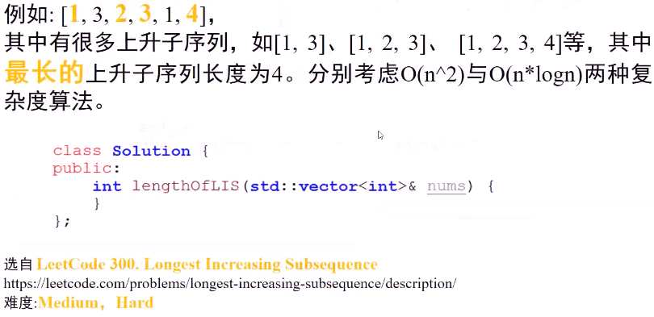
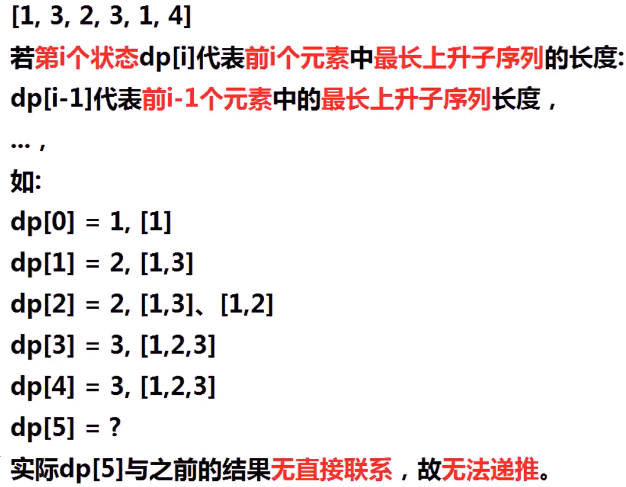
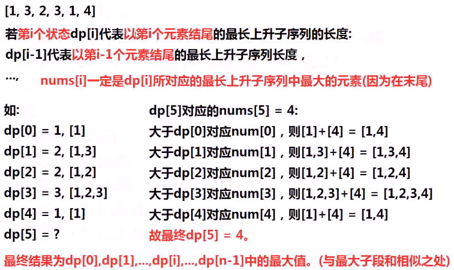
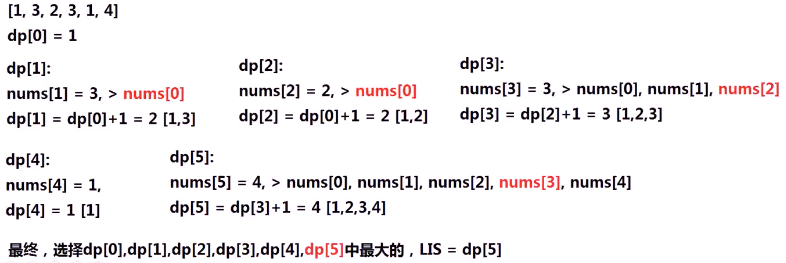
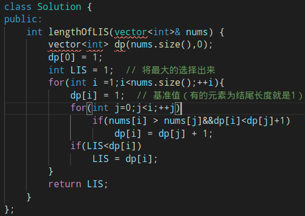
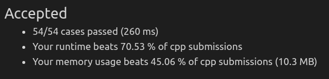

#### 一个未排序数组，求数组的最长上升子序列长度

* 

* 思考

  * 暴力枚举

    * > **枚举数组**的全部子序列，每个元素都有**选择、不选择**两种可能，时间复杂度O(2^n)，枚举时选择**最长的**子序列作为结果

  * dp

    * > ##### 设第i个状态为dp[i]
      >
      > 1. 若第i个状态表示**前i个数字**中最长上升子序列的长度，是否可以找出dp[i]与dp[i-1]的关系？
      > 2. 若第i个状态代表**以第i个数字为结尾**的最长上升子序列的长度，是否可找出dp[i]与dp[i-1]的关系？如何求出n个数字的最长上升子序列？
      > 3. 思考与最长字段和的**相似**之处

    * 分析

      * 
      * 
      * 
        * dp元素之间存在联系

* 算法思路

  * 设置dp数组，第i个状态dp[i]代表**以第i个元素结尾**的最长上升子序列的长度
    * dp边界：dp[0]=1
  * 从1--n-1，循环i，计算dp[i]:
    * 从0到i-1，循环j，若nums[i] > nums[j] ，说明nums[i]可放置在nums[j]后面，组成最长上升子序列
      * 若dp[i] < dp[j] + 1
        * dp[i] = dp[j]+1
  * 选择dp数组中最大的

* 代码实现
  * 
  * 