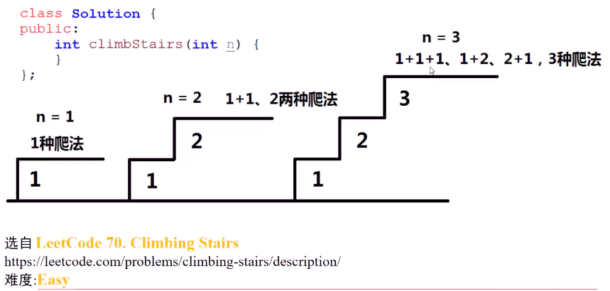
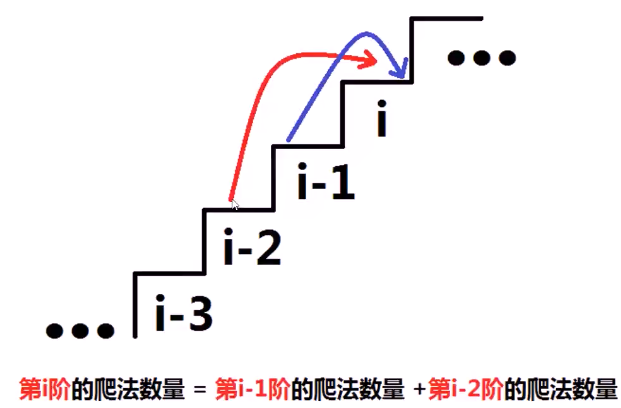
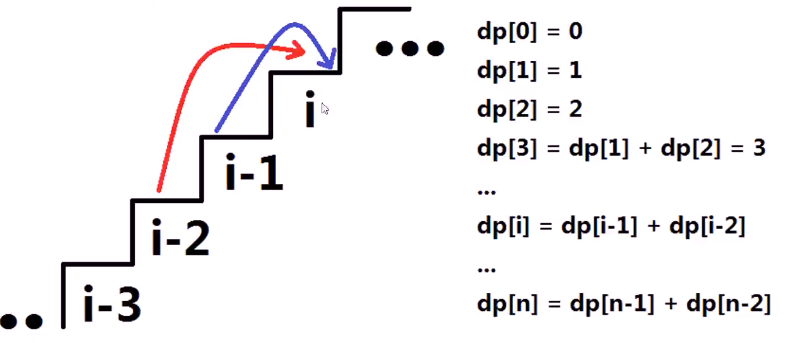

#### 每次可以爬一层或两层，问多少种上楼方式

* 

* 思考：**递推**的求出第i层爬法数量

  * 第i阶，只能从i-1与i-2到达，与其两个的爬法直接相关

  * 

  * >1. 设置递推数组dp[0...n]，dp[i]代表到达第i层，有多少种走法，初始化元素为0
    >2. 设置两个基础值dp[1] = 1,dp[2] = 2
    >3. 利用i循环递推从第3层到第n层结果
    >   1. 到达第i层的方法数量 = 到达第i-1层方法数量+到达第i-2层方法数量
    >   2. 

* 具体实现

  * ```c++
    int climbStairs(int n) {
        vector<int> dp(n+3,0);    // 防止数组越界
        dp[1] = 1;
        dp[2] = 2;
        for(int i = 3;i<=n;++i)
            dp[i] = dp[i-1] + dp[i-2];
        return dp[n];
    }
    ```

    

