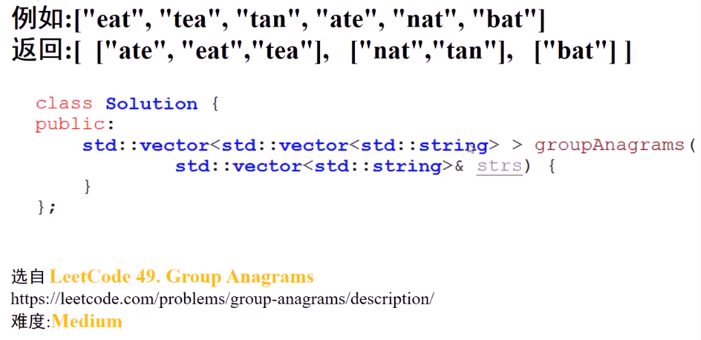
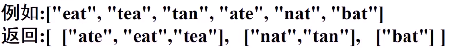
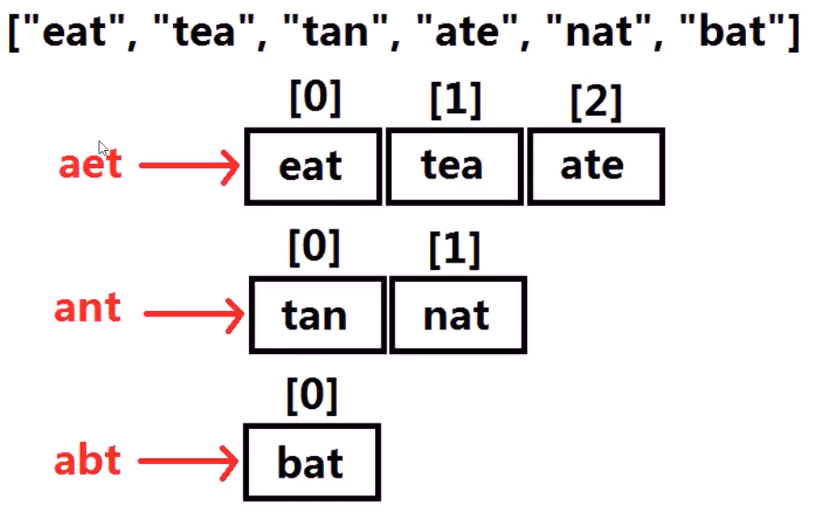
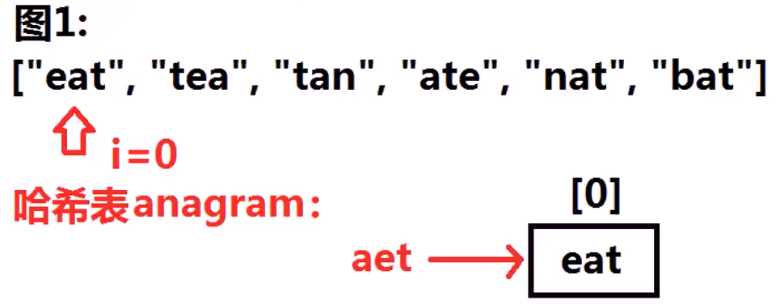
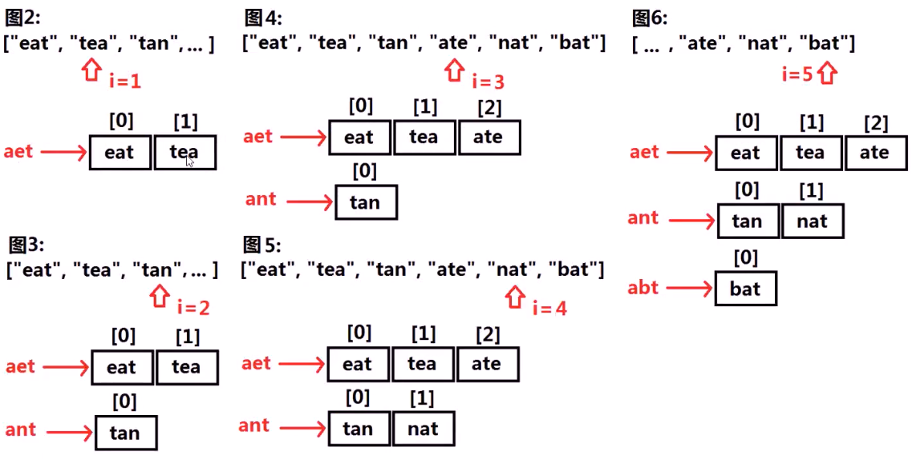
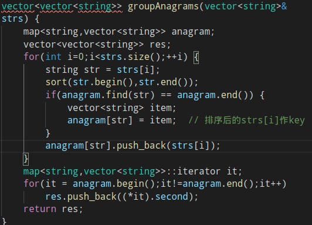
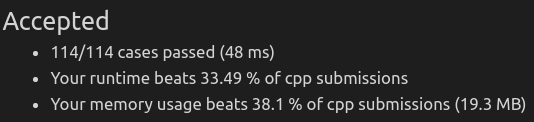

#### 一组字符串，将所有anagram（由颠倒字母顺序而构成的字）放在一起输出

* 

* **anagram分组**：若某两个字符串，出现的各个字符数相同，那它们应该同一组
  * 
    * 相同字符组成的都映射到一个key下
* 如何设计哈希表？
  * 内部将**每个单词排序后**结果作为**key**，以**字符串向量**（vector<string>）为**value**，存储各个**字符数量相同**的字符串
    * 
* 算法思路1
  * 设置**字符串到字符串向量**的哈希表anagram，遍历字符串向量strs中的单词strs[i]
    * 设置临时变量str=strs[i]，对**str进行排序**
    * 若str**没有出现**在anagram中，设置str到一个**空字符串向量**的**映射**
    * 将strs[i]**添加**到字符串向量anagram[str]中
    * **遍历**哈希表anagram，将全部key对应的value push到最终结果中
      * 
      * 
* 代码实现1
  * 
  * 

