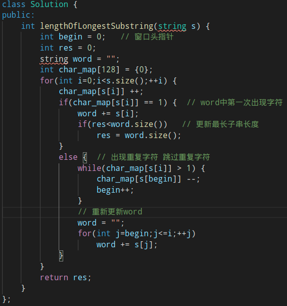
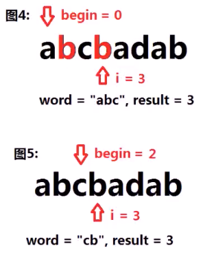

#### 求字符串的无重复字符的最长子串的长度

* 
* **子串**必须**连续**
* 思考
  * **枚举** s="pwwkew"的**所有子字符串**
    * 
  * **检查**上面所有字符串，是否**满足无重复**字符的条件，取**最长的**满足条件的子串作为结果
  * **优化目标**从O(n^2)到O(n)，需要将两重循环**枚举**扫描**修改**为一层
  * 最关键条件=**无重复字符**的子串，观察子串：
    * 
    * **红色框**的枚举没有意义，因为**蓝色框**中已经出现了**重复**字符
    * **绿色框**也无意义，后续枚举也不能出现**满足条件更优**子串

* 算法思路：（窗口双指针）
  * 设置一个记录字符数量的**字符哈希**，char_map
  * 设置一个记录当前满足条件的**最长子串**变量word
  * 设置**两个指针**（记为指针i和指针begin）指向字符串第一个字符
  * 设置最长满足条件的子串**长度**result
  * i指针向后**逐个扫描**字符串中字符，在这个过程中，使用char_map记录字符数量
    * **若**word中没出现过该字符：对word尾部**添加字符并检查**result是否需要更新
    * **否则**：begin指针向前移动，更新char_map中的字符数量，**直到**字符s[i]的数量为1；**更新**word，将word**赋值**为begin与i之间的子串
  * 整个过程中，使用begin和i维护一个**窗口**，该窗口中的子串**满足题目条件**（无重复的字符），窗口**线性向右滑动**，时间复杂度**O(n)**
    * 
    * 
    * 

* 代码实现
  * 
    * 重复字符逻辑
  * 

