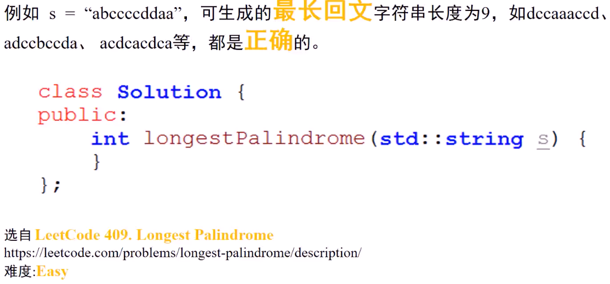
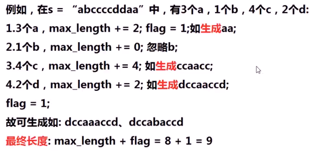
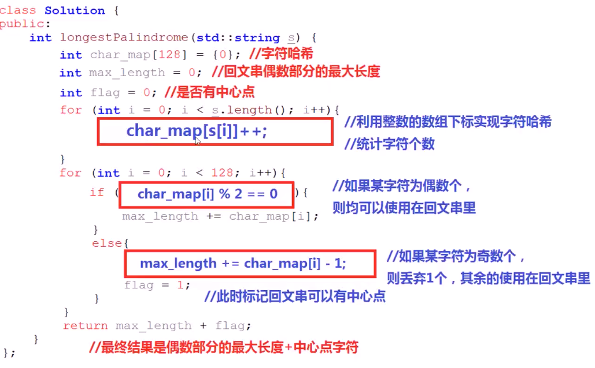
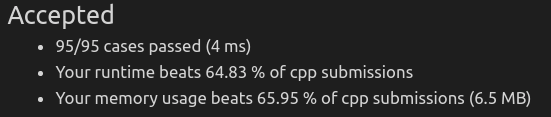

#### 用给定字符串中字符生成最长回文字符串，返回其长度

* 
* 在s="abccccddaa"中，3个a，1个b，4个c，2个d
* 使用s中字符，**任意组合**，生成新的字符串，若生成的字符串为回文字符串，需要除了**中心**字符，其他字符**只要在开头出现，尾部就要对应出现**
  * 例如a...a、ccd...dcc、cc...d...cc
* 思考
  * 字符串中，字符数量为**偶数**的字符，怎么处理
    * 一半放前面，一半放后面
  * 字符串中，字符数量为**奇数**的字符，怎么处理
    * 留一个当中心点，其他的保留偶数个如上处理

* 算法思路
  * 利用**字符哈希**，**统计**字符串中所有的**字符数量**
  * 设置最长回文串**偶数字符**长度为max_length=0
  * 设置是否有**中心点**标记flag=0
  * **遍历**每一个字符，**字符数**为count，若count为**偶数**，max_length+=count；若count为**奇数**，max_length+=count-1,flag=1；
  * 最终最长回文子串长度为：max_length+flag
    * 
* 代码实现
  * 
  * 