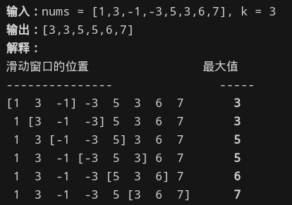
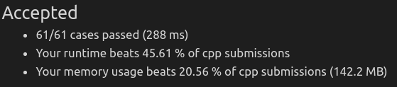

#### 给你一个整数数组 `nums`，有一个大小为 `k` 的滑动窗口从数组的最左侧移动到数组的最右侧。你只可以看到在滑动窗口内的 `k` 个数字。滑动窗口每次只向右移动一位。返回滑动窗口中的最大值。



* 思考

  * 暴力破解

    * ```c++
      // 暴力破解法，原来数组太长时 超时
      vector<int> maxSlidingWindow(vector<int>& nums, int k) {
          vector<int> window_max(nums.size()-k+1,0);
          for(int i=0;i<window_max.size();++i)
              window_max[i] = max_of_windows(nums,i,i+k);
          return window_max;
      }
      
      // 左闭右开
      int max_of_windows(vector<int> &nums,int begin,int end) {
          int max_ = nums[begin];
          for(int i=begin+1;i<end;++i)
              max_ = max(max_,nums[i]);
          return max_;
      }
      ```

    * 时间复杂度`O(n^2)`，不能满足需求，但是发现其最终返回的数组长度是可计算的

      * 从下标`k-1`开始就可以生成

  * 提示的堆和滑动窗口

    * 堆 -> 小顶/大顶，这里要求大小为`k`的窗口中最大值

    * 采用大小为`k`的大顶堆，得到一个值后，搜索删除第一个位置的值

      * 这里没有考虑到每次删除调整堆的复杂度
      * 导致最终复杂度陡增

    * ```c++
      template<typename T>
      class custom_priority_queue : public std::priority_queue<T, std::vector<T>>
      {
      public:
          bool remove(const T& value) {
              auto it = std::find(this->c.begin(), this->c.end(), value);
              if (it != this->c.end()) {
                  this->c.erase(it);
                  std::make_heap(this->c.begin(), this->c.end(), this->comp);
                  return true;
              }
              else {
                  return false;
              }
          }
      };
      
      vector<int> maxSlidingWindow(vector<int>& nums, int k) {
          custom_priority_queue<int> q;
          vector<int> window_max;
          for(int i=0;i<nums.size();++i) {
              // 当堆中元素少于k个，直接入堆
              if(q.size() < k) {
                  q.push(nums[i]);
              }
              // 大顶堆中元素已经==k，
              else{
                  window_max.push_back(q.top());
                  q.remove(nums[i-k]);
                  i--;
              }
          }
          window_max.push_back(q.top());
          return window_max;
      }
      ```

  * 最终方案：剪枝，不必要时不需删除元素

    * ```c++
      // 优化第二种做法，不是每个时候都需要删除（时复太高）
      // 只有当大顶 不在窗口内时候，才需要删除该大顶，保证其一直处于窗口内
      vector<int> maxSlidingWindow(vector<int>& nums, int k) {
          priority_queue<pair<int,int>> window;
          vector<int> res;
          for(int i=0,n=nums.size();i<n;i++) {
              // 当窗口不空且最大值不在窗口内，循环删除大顶
              while(!window.empty() && window.top().second <= i-k)
                  window.pop();
              window.push({nums[i],i});
              // 添加时机很重要
              if(i>=k-1)
                  res.push_back(window.top().first);
          }
          return res;
      }
      ```

    * 

