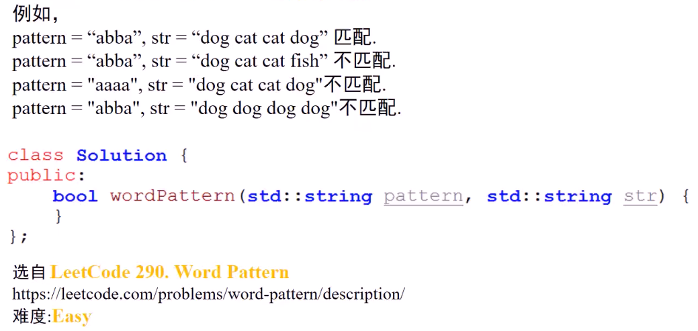

#### 确认字符串pattern和字符串str是否匹配（str中单词与pattern中字符是否一一对应）（两者都只有小写字符，str中单词用空格分隔）

* 

* 分析
  * **匹配**：字符串str中单词与pattern中字符**一一对应**
  * 
  * 结论
    * **拆解**出一个单词，若该单词**已出现**，则当前单词对应的pattern字符必为该单词**曾经对应**的pattern字符
    * **拆解**出一个单词，若该单词**未出现**，则当前单词对应的pattern字符也必须**未曾出现**
    * 单词个数和pattern字符串中字符**数量相同**

* 算法思路
  * 设置单词（字符串）到pattern字符的**映射(哈希)**；使用数组used[128]记录pattern字符是否使用过
  * 遍历str，按照空格**拆分单词**，同时**对应的**向前移动指向pattern字符的指针，每拆分出一个单词，判断：
    * 如果该单词**从未出现**在哈希表中
      * 如果当前的pattern字符**已被使用**，返回false
      * 将单词与当前指向的pattern字符**做映射**
      * **标记**当前指向的pattern字符**已使用**
    * 否则
      * 如果当前单词在哈希表中的**映射字符**不是当前指向的pattern字符，则返回false
    * 若单词个数与pattern字符个数**不匹配**，返回false
    * 
    * 
* 代码实现
  * 
  * 

