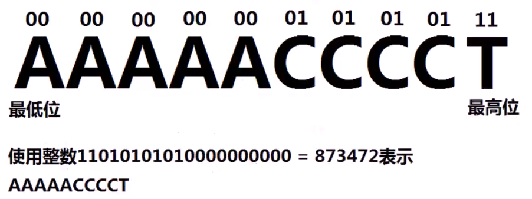
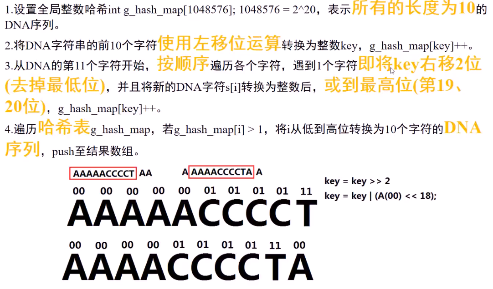
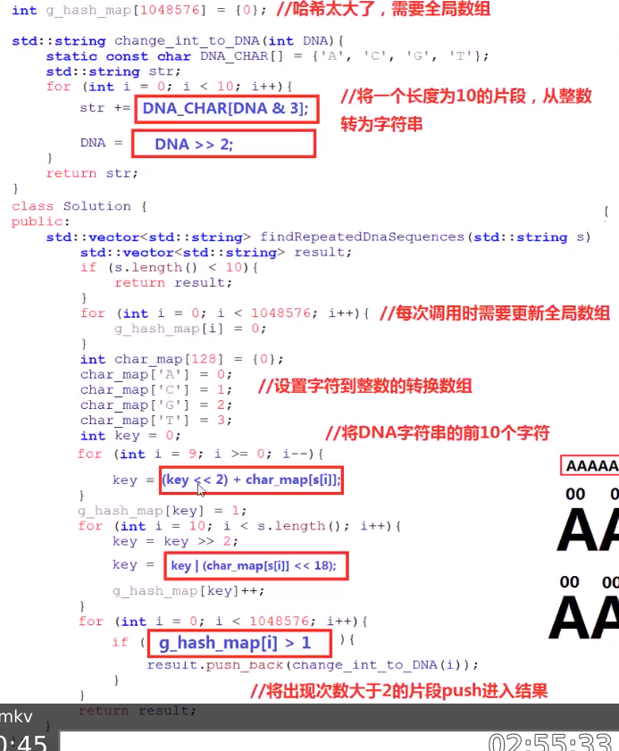
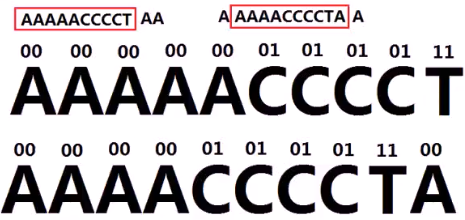

#### 将DNA序列看做['A','C','G','T']四个字符的字符串，给定字符串，找到所有长度为10的且出现超过一次的子串

* 

* 算法思路1
  * 枚举**DNA字符串**中的所有长度为10的子串，将其插入到**哈希map**中，并且**记录子串数量**；遍历哈希表，将所有**出现超过1次**的子串储存到结果中。O(n)
    * 
* 代码实现1
  * 

* 算法思路2
  * 将长度为10的**DNA序列**进行整数编码
    * [A, C,G,T]四个**字符**分别用[0,1,2,3]（二进制形式（00，01，10，11）表示），长度为10的DNA序列可以用20个比特位的**整数**所表示，如：
    * 
  * 

* 代码实现2
  * 
  * 

