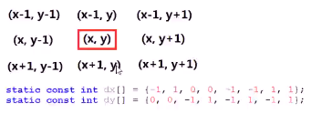
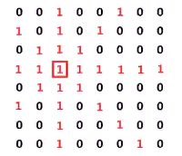
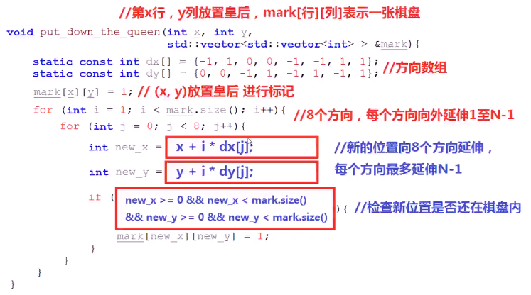
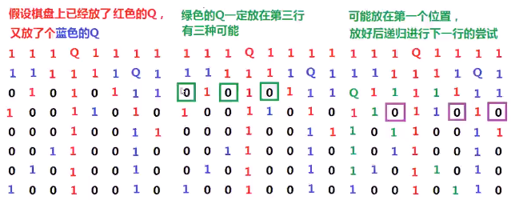
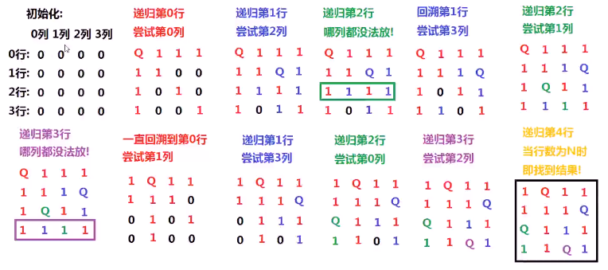
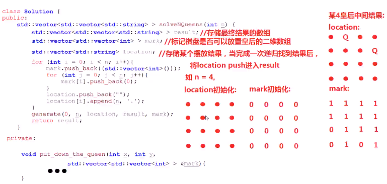
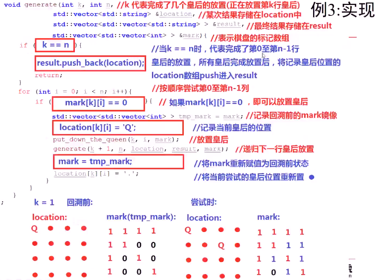

* 皇后的攻击范围

  * 以其为中心，上下左右、左上、左下、右上和右下8个方向都被占据
  * 
    * ps：图中红色部分都是皇后的攻击范围
  * nxn棋盘只能放n个

* 思考：放置皇后，更新棋盘的过程

  * 使用二维数组mark [] [] 表示一张空棋盘
  * 设置方向数组（搜索二维数组很有用）
    * 
  * 按照方向数组的8个方向分别延伸N个距离，只要不超过边界，mark [] [] = 1
    * 
  * 
  * 回溯解决n皇后问题
    * nxn棋盘，每行都要放1个且只能放一个
    * 递归的对每一行 放置皇后，放置时，按列顺序寻找可以放置皇后的列
      * 可以放就放，更新mark标记数组。递归下一行皇后放置；
      * 该次递归结束后，恢复mark数组，并尝试下一个可能放置皇后的列
      * 当递归可以完成N行的N个皇后的放置，将结果保存并返回
    * 
    * 

* 具体实现

  * 

  * 

    

