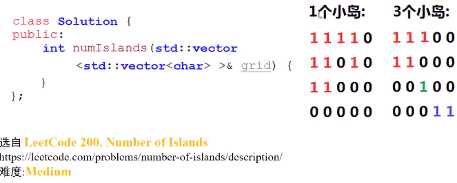
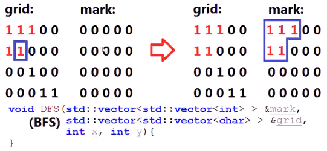
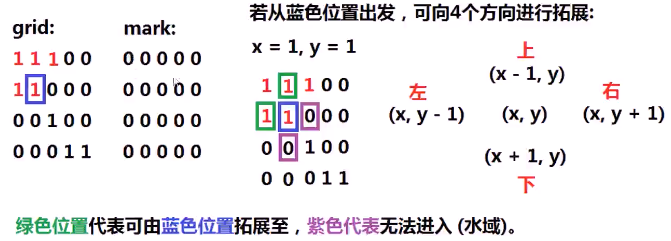
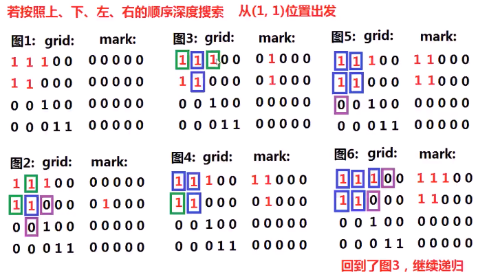
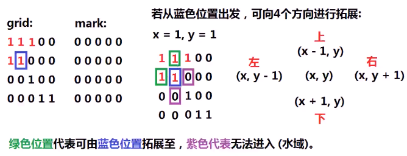
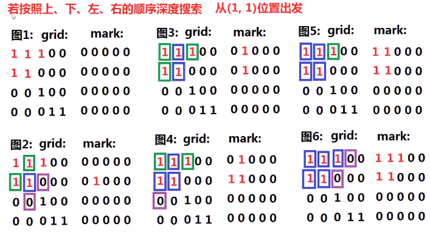
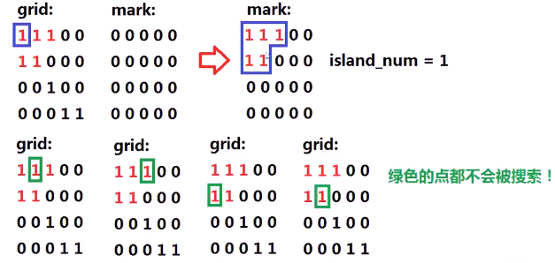
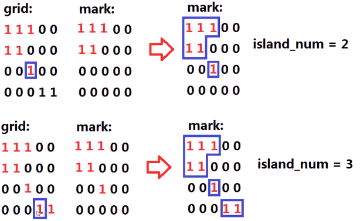
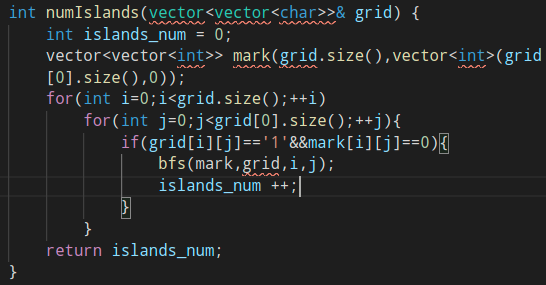
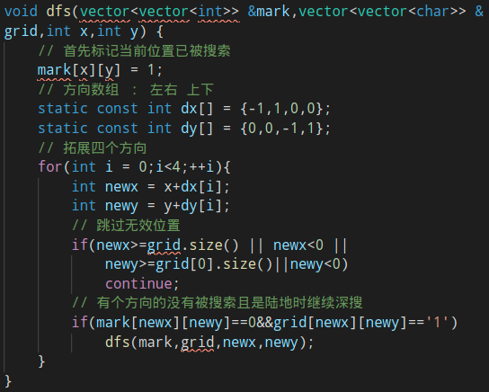

#### 二维数组代表地图，0==水，1==土地，1被0包围，当1水平和垂直方向相连接，认为同一块土地。求图中小岛数量

* 

* 思考：搜索独立小岛

  * 怎么搜索出轮廓

  * > 给定二维数组grid和**二维标记数组mark**（初始化为0），mark数组的每个位置都与grid**对应**，设计一个**搜索**算法，从该地图中某个岛的某个**位置**出发，**搜索**该岛的全部土地，将搜索到的位置在mark数组中**标记**为1
    >
    > 

  * 如何设计一个**深度优先搜索**（DFS）？（不需要带回溯）

    * > 1. 标记当前搜索位置为**已被搜索**（标记当前位置的mark数组为1）
      > 2. 按照方向数组的4个方向，**拓展**4个新位置newx、newy
      > 3. 若新位置**不在地图范围内**，则**忽略**
      > 4. 若新位置**未曾到达**过（mark[newx] [newy]为0）、且是**陆地**（grid[newx] [newy]），**继续DFS**该位置
      >
      > 
      >
      > 

  * 如何设计一个**宽度优先搜索**（BFS）？

    * > 1. 设置**搜索队列Q**，标记mark[x] [y] =1，并将**待搜索的位置**(x,y)push进入队列Q
      > 2. 只要队列不空，即**取队头元素**，按照方向数组的四个方向，**拓展**4个新位置newx，newy
      > 3. 若新位置不在地图范围内，忽略
      > 4. 若新位置**未曾搜索过**（mark[newx] [newy] 为0）、且是陆地（grid[newx] [newy]为1），将新位置push进入队列，标记mark[newx] [newy] = 1
      >
      > 
      >
      > 

* 算法实现 

> 1. 设置岛屿数量**island_num** = 0
> 2. 设置mark数组，并**初始化**
> 3. 遍历**地图grid**上所有的点，如果当前点是**陆地**，且没有被访问过，调用**搜索**接口；**完成**搜索后island_num++
>
> 
>
> 

* 代码实现
  * 
  * 
  * 
  * 