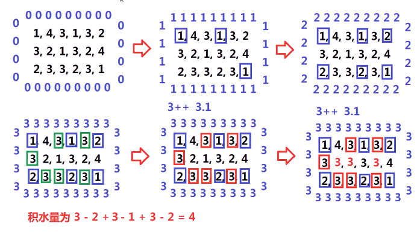

#### 已知一个mxn的二维数组，数组存储正整数，代表一个个单元的高度（立方体），将这些立方体想象成水槽，问如果下雨这些立方体中会有多少积水

* 

* 思考
  * 
  * 
  * 分析2
    * 想象水从外往里流，慢慢上升
    * 
    * 

* 算法思路
  * 搜索队列使用**优先级队列（堆）**，**越低矮**的点**优先级越高**（最小堆），**越优先**进行搜索
  * 以矩形**四周的点**作为**起始点**进行广度优先搜索（这些点要**最初**push进队列）
  * 使用一个二维数组对push进入队列的点进行**标记**，之后搜索到该点后，**不再**push到队列中
  * 只用优先级队列**不空**，即取出优先级队列队头元素进行搜索，按照**上下左右**四个方向进行拓展，拓展过程中**忽略超出边界与已入队列**的点
  * 当对某点（x，y，h）进行**拓展**时（h即为（x，y）位置的高度，heightMap[x] [y]）
    * 得到的**新点**为（newx，newy），**高度**为heightMap[newx] [newy]
    * **若**h大于heightMap[newx] [newy]
    * 最终结果+=h-heightMap[newx] [newy]
    * 将heightMap[newx] [newy]**赋值**为h（即升高该位置的水面）
  * 将（newx，newy，heightMap[newx] [newy]）**push进入**优先级队列，并做标记
  * 
  * 
  * 
  * 

* 前置知识

  * 结构体的STL优先级队列

  * 

    

* 代码实现
  * 初始化队列
    * ****
  * 搜索
    * [127.词语阶梯](./note/搜索/词语阶梯.md)