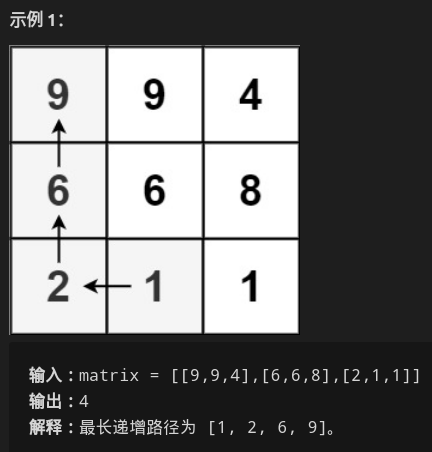
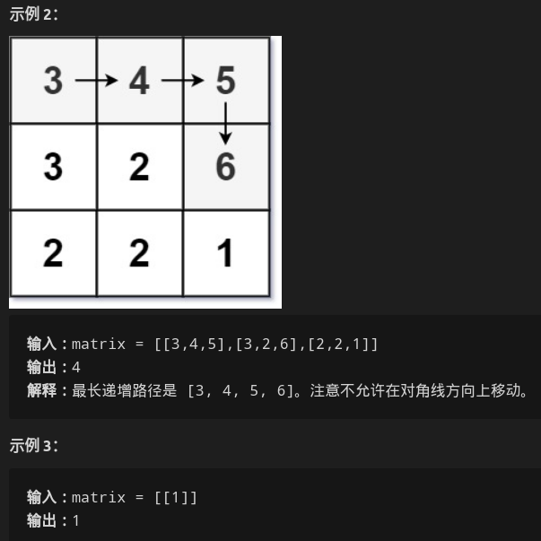
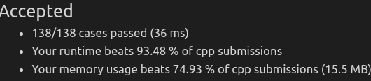

##### 给定一个`MxN`的整数矩阵`m`，找出其最长递增路径长度

* 只能上下左右四个方向

* 

* 

* 思考

  * 使用一个大小和原矩阵一样的新矩阵`store`，`store[i][j]`表示在原矩阵上走到格子`(i,j)`时，最长的递增路径长度

  * ```c++
    // 考虑dfs，把每个点都搜索一哈
    int longestIncreasingPath(vector<vector<int>>& m) {
        // base case
        if(!m.size()||!m[0].size()) return 0;
        int h=m.size();
        int w=m[0].size();
        // store[i][j]表示在原矩阵从(i,j)位置出发时，能达到最长的递增路径长度
        vector<vector<int>> store(h,vector<int>(w,0));
        int ans = 0;
        // 遍历每一个格子，找出其中的最大值
        // 也就是从所有的从该点出发能到达最长的最大路径
        for(int i=0;i<h;++i)
            for(int j=0;j<w;++j)
                // dfs函数返回该点该填入的store[i][j]值
                ans = max(ans,dfs(m,i,j,store));
        return ans;
    }
    
    int dfs(vector<vector<int>> &m,int i,int j,vector<vector<int>> &store) {
        // 当该位置不为0时，代表其已经被填好了
        if(store[i][j]) return store[i][j];
        // 首先默认该点为1，后续再进行更新
        // 也就是例2图中6的地方，默认为1
        store[i][j]++;
    
        // 该点可到达上方点 == 上方点比该点处值大
        // dfs进入上方点
        if(i-1>=0&&m[i-1][j] > m[i][j])
            store[i][j] = max(store[i][j],dfs(m,i-1,j,store)+1);
        if(i+1<m.size()&&m[i+1][j] > m[i][j])
            store[i][j] = max(store[i][j],dfs(m,i+1,j,store)+1);
        if(j-1>=0&&m[i][j-1] > m[i][j])
            store[i][j] = max(store[i][j],dfs(m,i,j-1,store)+1);
        if(j+1<m[0].size()&&m[i][j+1]>m[i][j])
            store[i][j] = max(store[i][j],dfs(m,i,j+1,store)+1);
    
    
        return store[i][j];
    }
    ```

  * 