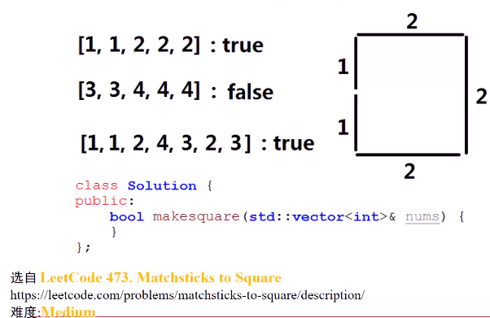

#### 已知一个数组，保存n个（n<=15）火柴棍，问是否可以使用n个火柴棍摆成一个正方形

* 
* 思考
  * n个火柴棍（n<=15），每个**火柴棍**可以属于正方形4个边中其中一个。暴力搜索（回溯搜索）有4^15种可能
  * 回溯如何设计
  * 递归的回溯搜索何时返回**真**，何时返回**假**
  * 普通回溯搜索可否解决问题，如何对dfs进行优化（**剪枝**），即可使得回溯搜索更加高效
  * 是否可用位运算解决

* 算法1：无优化的深度搜索
  * 想象往4个桶中放火柴，每个火柴杆**回溯的位置**在每个桶中，在放完n个火柴杆后，检查4个桶中火柴杆**长度和**是否相同，**相同**返回**真**，**否则**返回**假**；在回溯过程中，如果当前**所有可能**向后的**回溯**，都无法满足条件，即递归函数**最终**返回假
    * 
* 优化
  1. n个火柴杆的总和**对4取余**需要为0，否则直接返回**假**
  2. 每次放置时，每条边上不可放置**超过总和**的1/4长度的火柴杆
  3. 火柴杆**从大到小**的顺序排序，先尝试大的减少**回溯**可能
     1. 
     2. 如果小的在前，那么有更多的回溯法，而把大的摆了之后，回溯的选择更少了

* 代码实现
  * 
  * 

* 解法二：位运算
  * 构造集合与子集
  * 要知道到底哪些集合元素能凑成一条边

> 1. 构造出所有和为target（总和/4）的**子集**，存储在向量ok_subset中，这些是**候选的边**的组合
>
> 2. 遍历所有的ok_subset，**两两进行对比**，如果ok_set[i]和ok_set[j]进行**与运算**的结果为0，则说明ok_set[i]和ok_set[j]表示的是**无交集**的两个集合（没有选择同样的火柴棍），这两个集合可以代表两个可以**同时存在**的满足条件的边；将ok_set[i]与ok_set[j]**求或**（绑定两个边），结果存储在ok_half中，代表所有**满足一半结果**的情况。
>    1. 通过位运算生成所有的子集
> 3. 遍历所有的ok_half，**两两进行对比**，如果ok_half[i]和ok_half[j]进行**与运算**结果为0，则返回true（说明找到4个满足条件的边，即可组成**正方形**）；否则返回fakse
> 4. 

* 代码实现
  * 
  * 

