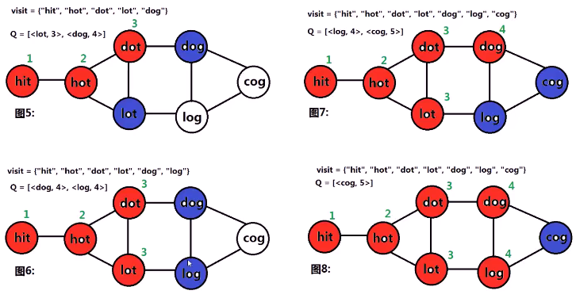

#####  已知两个单词（起始单词与结束单词），一个单词词典，根据转换规则计算从起始单词到结束单词的最短转换步数

> 转换规则：
>
> 1. 转换时，只能转换单词中的**1个字符**
> 2. 转换得到的**新单词**，必须在单词词典中

* 

* 思考

  * > 单词与单词之间的**转换**，就是**一张图**，**顶点**是单词，两个单词能**相互转换**就是两个顶点间有**一条边**（这里是无向边），求图中两个指定节点所有路径中，**最短路径** ==> BFS搜索
    >
    > 

  * 算法思路：图的构造与表示
    * 图是一种逻辑结构，用什么构造无所谓，怎么方便使用怎么来
    * 使用map构造**邻接表**表示的图，map定义为以string为key（代表图的顶点），vector<string>为value（代表图的各个顶点**邻接的顶点**）。
      * 
      * 将beginWord push进wordList。**遍历**wordList，对**任意两个**单词wordList[i]与wordList[j]，若wordList[i]与word[j]**只.0相差一个**字符，则将其**相连接**
    * ****

* 总体思路：BFS搜索
  * 给定图的**起点**beginWord，**终点**endWord，**图**graph，从beginWord开始**bfs**搜索图graph，搜索过程中记录到达**步数**
    * 设置搜索**队列Q**，队列节点为pair<顶点,步数>；设置**集合visit**，记录已搜索过顶点；将<beginWord,1>添加到队列
    * 只要队列不为空，取出队列头部元素
      * 若取出队列头部元素为endWord，返回**到达当前节点的步数**
      * 否则**拓展**该节点，将该节点**相邻**的且**未添加**到visit中的节点与步数同时添加到队列Q，并将**拓展节点**加入visit
    * 若最终都无法搜索到endWord，**返回0**
* 
* 
* 

* 
* 

