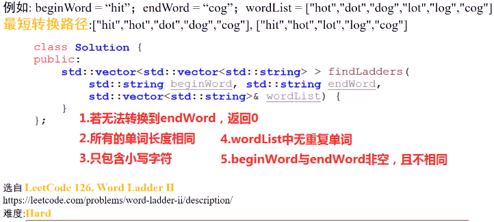
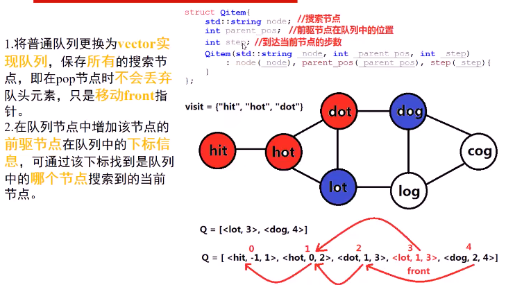

#### 两个单词，一个单词词典，根据转换规则计算所有的从起始单词到结束单词的最短转换路径

> 转换规则：1. 只能转换单词中**一个字符**；2. 转换得到的**新单词**，必须在单词词典中
>
> 

* 思考
  1. 在BFS时，如何**保存路径**
  2. 如果有**多条路径**，如何将多条路径**都搜索出来**
  3. 在建立beginWord和endWord**连接**时，若单词表中**已包含**beginWord，按照之前的方案建立图，会有**什么问题**？
     1. 