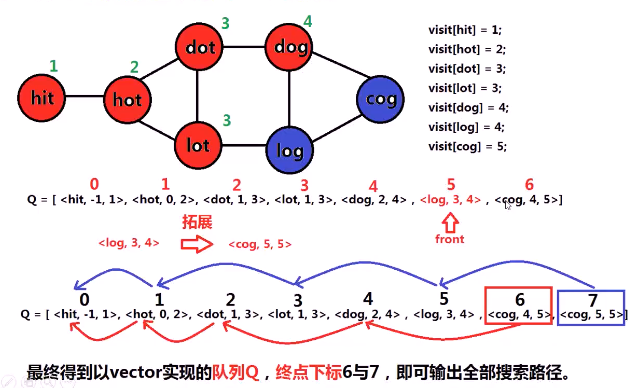
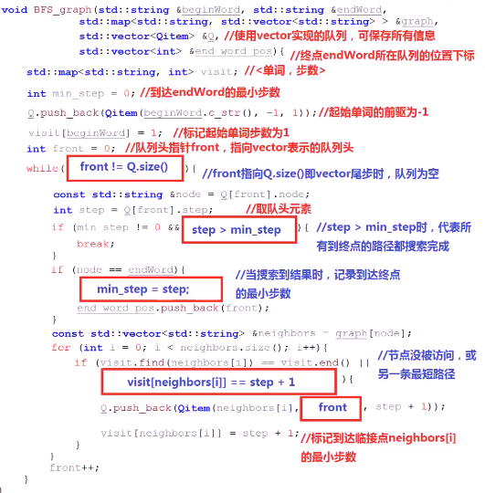
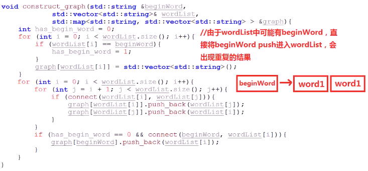
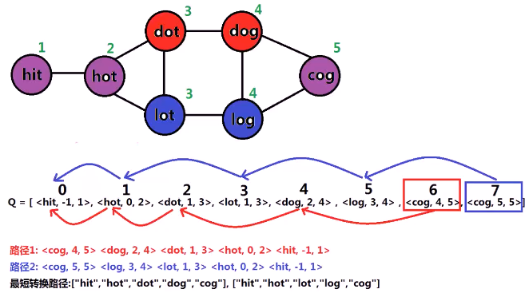
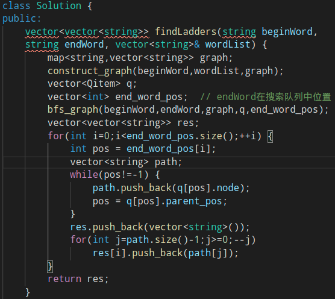

#### 两个单词，一个单词词典，根据转换规则计算所有的从起始单词到结束单词的最短转换路径

> 转换规则：1. 只能转换单词中**一个字符**；2. 转换得到的**新单词**，必须在单词词典中
>
> 

* 思考
  1. 在BFS时，如何**保存路径**   存储问题
     1. 
        1. 队列只是一种逻辑结构，不一定要用某一个数据结构来实现
        2. 这里就采用vector来实现
  2. 如果有**多条路径**，如何将多条路径**都搜索出来**
     1. 到达某一位置可能存在**多条路径**，使用**映射**（map）记录到达每个位置的**最短需要的步数**，新拓展到的位置只要**未曾到达**或到达步数**与最短步数相同**，即将该位置**添加**到队列中，从而存储了**从不同前驱到达该位置的情况**
        1. 
        2. 
  3. 在建立beginWord和endWord**连接**时，若单词表中**已包含**beginWord，按照之前的方案建立图，会有**什么问题**？

* 代码实现
  * 
  * 
    * 测试样例中可能有beginWord或无
  * 遍历搜索路径
    * 从所有结果endWord所在的**队列位置**（end_word_pos），**向前遍历**直到起始单词(beginWord)，遍历过程中，**保存路径**上的单词。如此遍历得到的**路径**为endWord到beginWord的路径，将其**从尾到头**的顺序存储到最终结果中即可。
    * 
    * ****
    * 
