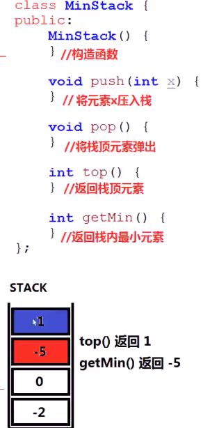

##### 设计一个栈，支持算法复杂度是`O(1)`的`push(x).pop(),top(),getMin()`

* 

* 思考

  * `1`个变量`MIN`无法记录栈中所有状态的最小值

  * 栈的每个状态，都需要有一个变量记录最小值

  * 

  * 用一个同步的存储最小值的栈

    * 

    * ```c++
      public:
          stack<int> s1;
          // 第二个栈只有一个功能，将最小值放在栈顶
          stack<int> s2;
          /** initialize your data structure here. */
          MinStack() {
              
          }
          
          void push(int val) {
              s1.push(val);
              if(s2.empty()||val<=getMin()) s2.push(val);
          }
          
          void pop() {
              if(s1.top()==getMin()) s2.pop();
              s1.pop();
          }
          
          int top() {
              return s1.top();
          }
          
          int getMin() {
              return s2.top();
          }
      };
      ```

    * 