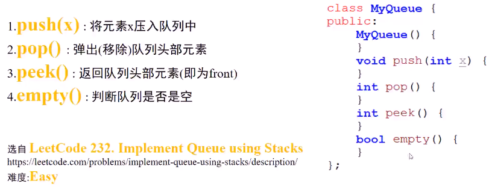
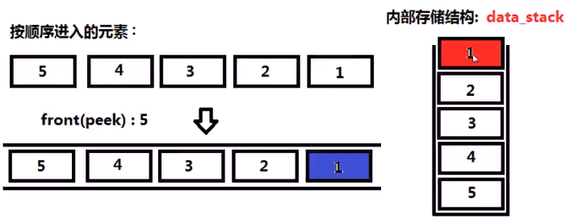
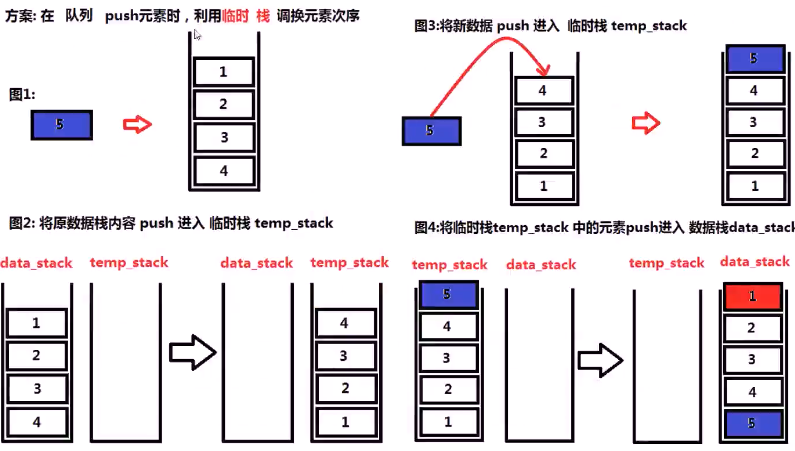
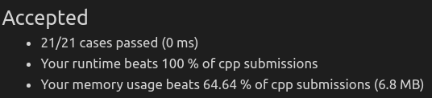

##### 设计一个队列，包括基本的队列操作，队列内部存储数据的结构为栈，栈的方法只能有`push、top、pop、size、empty`等标准的栈方法

* 

* 思考

  * 

  * 

  * ```c++
    public:
    	void push(int x) {
            stack<int> tmp_stack;
            while(!_data.empty()) {
                tmp_stack.push(_data.top());
                _data.pop();
            }
            tmp_stack.push(x);
            while(!tmp_stack.empty()) {
                _data.push(tmp_stack.top());
                tmp_stack.pop();
            }
        }
    
        int pop() {
            int x = _data.top();
            _data.pop();
            return x;
        }
    
        int peek() {
            return _data.top();
        }
    
        bool empty() {
            return _data.empty();
        }
    
    private:
        stack<int> _data;
    ```

  * 