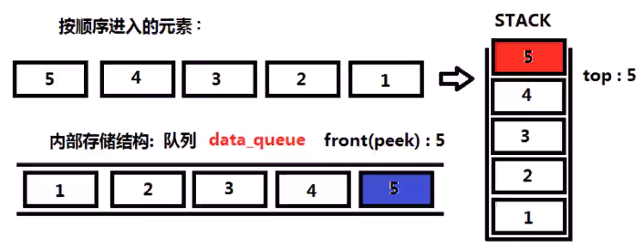
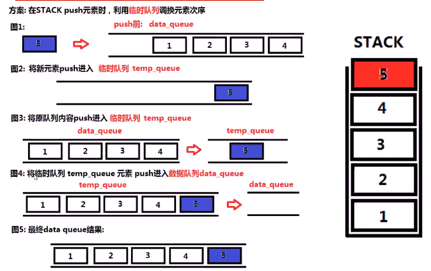

##### 设计一个栈，支持基本的栈操作，栈内部存储数据的结构为队列，队列方法只能有`push、peek(front)、pop、size、empty`等标准的队列方法

* 

* 思考

  * 

  * `push`

    * 

    * ```c++
      public:
      	void push(int x) {
              queue<int> tmp_q;  
              tmp_q.push(x);             // tmp_q:2
              while(!q.empty()) {        // q:1
                  tmp_q.push(q.front()); // tmp_q:2,1
                  q.pop();
              }
              while(!tmp_q.empty()) {   
                  q.push(tmp_q.front()); // q:2,1
                  tmp_q.pop();
              }
          }
      
          int pop() {
              int x = q.front();
              q.pop();
              return x;
          }
      
          int top() {
              return q.front();
          }
      
          bool empty() {
              return q.empty();
          }
      
      private:
          queue<int> q; 
      ```

    * 

