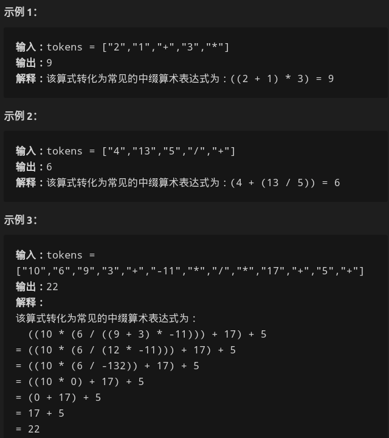

##### 根据逆波兰表示法，求表达式的值，有效运算符包括`+,-,*,/`，每个数字元素都是整数

* 

* 思考

  * 相当于后序遍历完全二叉树的结果

  * 遍历数组，碰到一个运算符，就将其前两个元素通过具体运算符计算出来，加入数组，调整指针

  * 需要几个函数：

    * 判断是否为数字
    * 计算

  * 代码实现

    * ```c++
      void compute_(vector<string> &tokens,int i) {
          // 加减乘除
          if(tokens[i] == "+") {
              int res = stoi(tokens[i-2]) + stoi(tokens[i-1]);
              tokens.insert(tokens.begin()+i-2,to_string(res));
              tokens.erase(tokens.begin()+i-1,tokens.begin()+i+2);
          }
          else if(tokens[i] == "-") {
              int res = stoi(tokens[i-2]) - stoi(tokens[i-1]);
              tokens.insert(tokens.begin()+i-2,to_string(res));
              tokens.erase(tokens.begin()+i-1,tokens.begin()+i+2);
          }
          else if(tokens[i] == "*") {
              int res = stoi(tokens[i-2]) * stoi(tokens[i-1]);
              tokens.insert(tokens.begin()+i-2,to_string(res));
              tokens.erase(tokens.begin()+i-1,tokens.begin()+i+2);
          }
          else {
              int res = stoi(tokens[i-2]) / stoi(tokens[i-1]);
              tokens.insert(tokens.begin()+i-2,to_string(res));
              tokens.erase(tokens.begin()+i-1,tokens.begin()+i+2);
          }
      }
      
      // 整数第一个字符要么是`-`，要么没有
      bool isNum(const char* str) {
          bool isNum = false;
      
          int index = 0;
          for (; *str != '\0'; str++, index++)
          {
              switch (*str)
              {
                  // 当前是数字时，设置标志符为true
                  case '0':
                  case '1':
                  case '2':
                  case '3':
                  case '4':
                  case '5':
                  case '6':
                  case '7':
                  case '8':
                  case '9':
                      isNum = true;
                      break;
                      // 前面有符号时，设置为
                  case '-':
                      // case '+':
                      if (index != 0)
                      {
                          return false;
                      }
                      break;
                  default:
                      return false;
              }
          }
          if (!isNum)
          {
              return false;
          }
          return true;
      }
      
      int evalRPN(vector<string>& tokens) {
          for(int i=2;i<tokens.size();) {
              // 找到一个运算符
              if(!isNum(tokens[i].c_str())) {
                  compute_(tokens,i);
                  i -= 1;
              }
              else i++;
          }
          return stoi(tokens[0]);
      }
      ```

* 主要注意的是
  * `c_str()`方法返回字符串的头地址，正好用于判断数字的函数