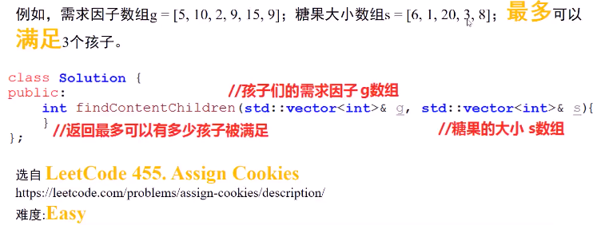
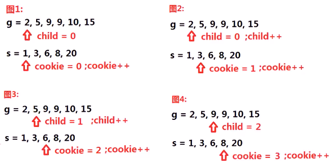
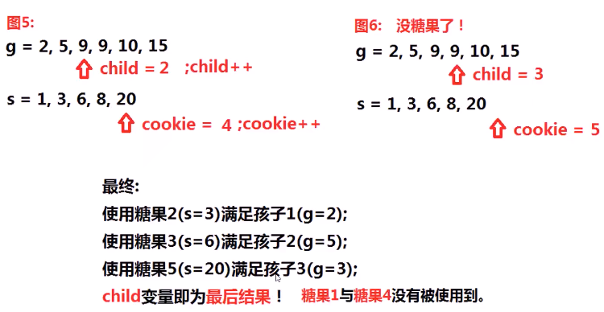
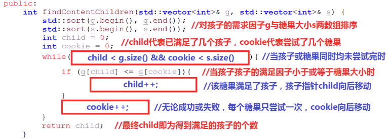

#### 一些孩子和一些糖果，每个孩子有需求因子g，每个糖果有大小s，当某个糖果大小s>=某个孩子需求因子g时，代表该糖果可以满足该孩子；求使用这些糖果，最多能满足多少个孩子？（每个孩子最多只能用1个糖果满足）

* 

* 思考
  * 对g和s进行排序
  * g=[2,5,9,10,15]，s=[1,3,6,8,20]
    * 当某个孩子可以被**多个糖果**满足时，是否需要**优先**用某个糖果满足这个孩子
    * 当某个糖果可以满足**多个孩子**时，是否需要**优先**满足某个孩子
  * **核心目标** ： 让更多孩子得到满足：
    * 某个糖果**不能满足**某个孩子，该糖果也**不能满足**需求因子**更大**的孩子
    * 某个孩子可以用更小的糖果满足，没必要用**更大糖果**满足，尽量**保留更大**的糖果，满足需求因子更大的孩子。(**贪心！**)
    * 孩子需求因子更小更容易被满足，故**优先**从**需求因子更小**的孩子尝试，可以得到正确的结果
* 算法思路
  * 对**需求因子**数组g和**糖果大小**数组进行**从小到大**的排序
  * 按照**从小到大**的顺序使用各糖果尝试是否可满足某个孩子，每个糖果只尝试**1次**；若尝试成功，则换下一个孩子尝试；直到发现没有**更多的孩子**或没**更多的糖果**，循环结束
    * 
    * 
* 代码实现
  * 
  * 
* 找不到反例，思路就是正确的

