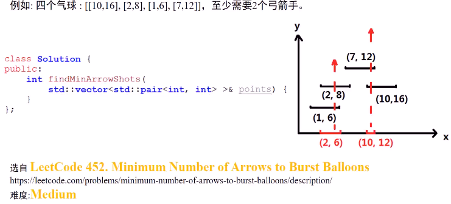
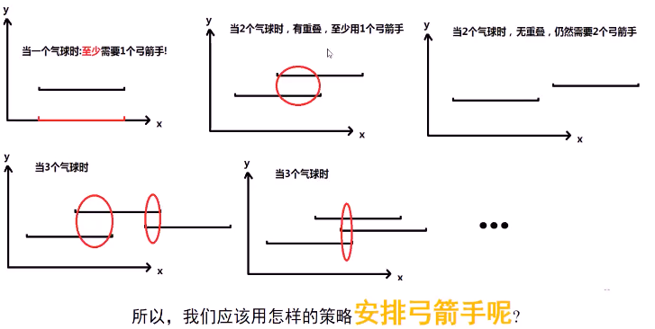
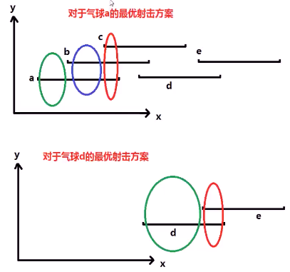
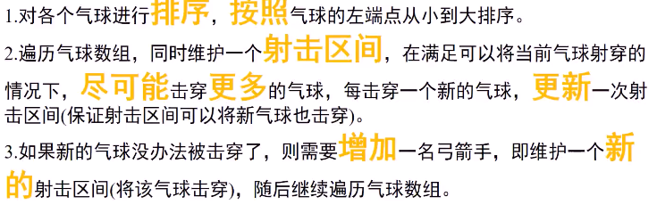
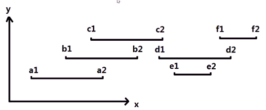
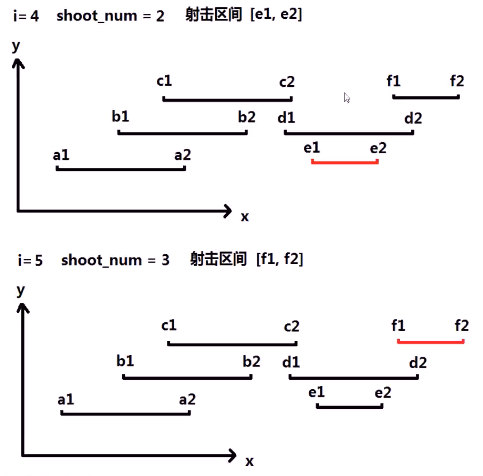
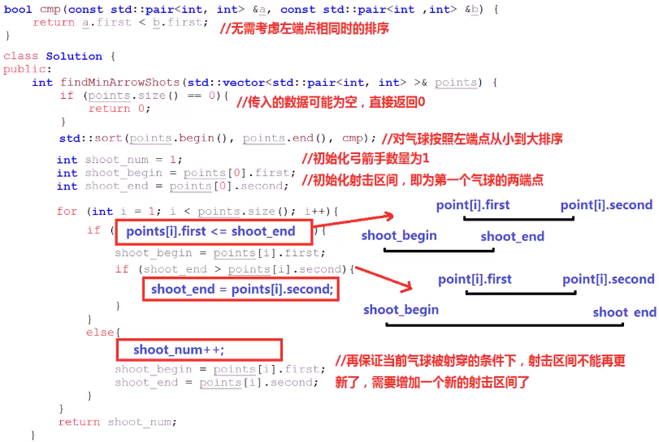
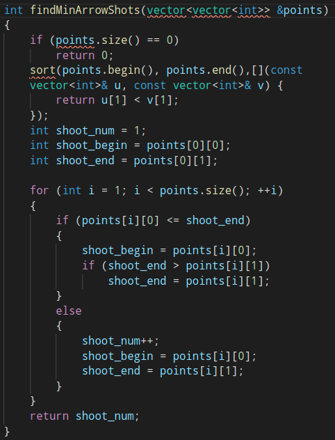

##### 平面上有一定数量气球，平面x轴不同位置安排弓箭手向y轴方向射箭，弓箭可以向y轴走无穷远；给定气球的宽度xstart<=x<=xend，至少需要多少弓箭手，将全部气球打爆

* 

* 思考
  * 
* 贪心规律
  * 对于某个气球，**至少需要**使用**一支弓箭**射穿
  * **将其击穿同时**，尽可能击穿其他更多气球（贪心）
  * 
* 算法思路
  * 
  * 
  * 
  * 
* 代码实现
  * 
  * 
  * 

