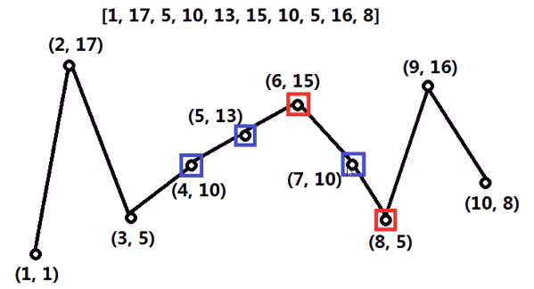

#### 两个相邻元素之间的差正负（负正）交替出现，则该序列被称为摇摆序列。一个小于2个元素的序列直接为摇摆序列

* 

* 思考
  * 最好方法解决贪心：举例子
  * 
  * 不清楚原始序列的7位是什么的情况下，**只看前6位**，摇摆子序列的**第4位**从10，13，15中**选择一个**数
  * 选择哪一个比较好？
    * 
  * 贪心规律
    * 序列有一段**连续递增（或递减）**，为形成**摇摆子序列**，只需要保留这段连续的递增（或递减）的**首尾元素**，这样**更可能**使得尾部的后一个元素成为摇摆序列的下一个元素
    * 
    * 
  * 状态机
* 代码实现
  * 
  * 

