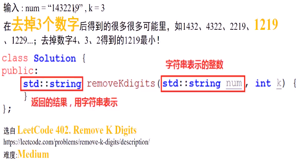
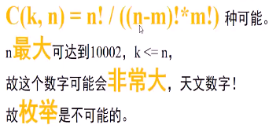
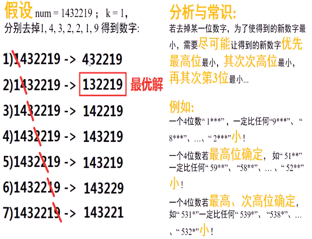
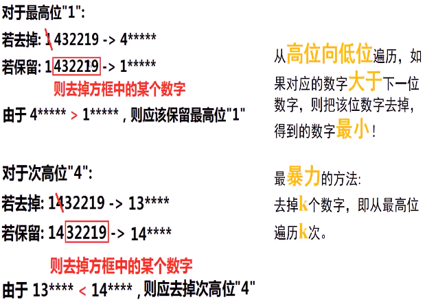
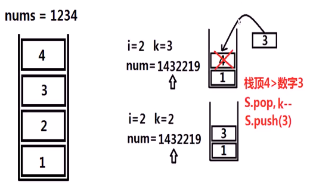
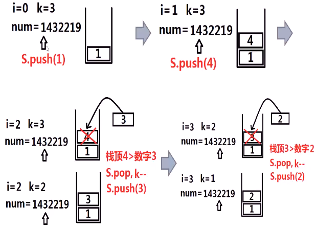
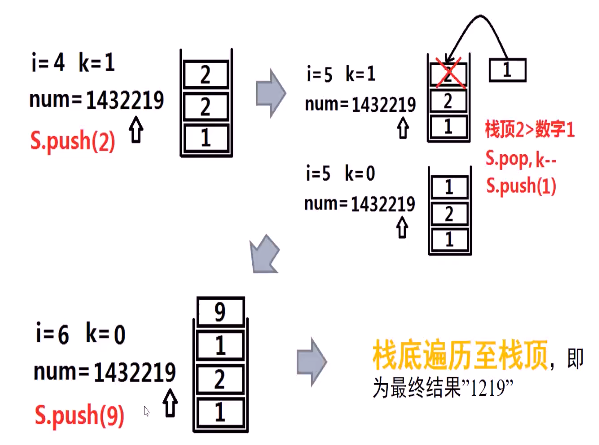
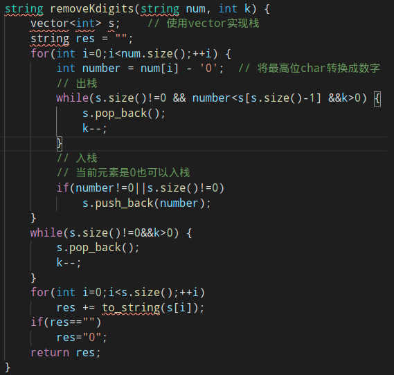
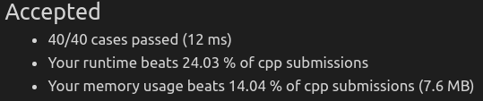

##### 字符串表示的非负整数num，将num中k个数字移除，求移除k个数字后，可以获得的最小的可能的新数字

* 
* 思考
  * 一个长度为n的数字，去掉k个数字，可以有**多少种**可能？
  * 
  * 假设**只去掉一个**数字，应该去除哪一个？如果k>1，我们应该用什么策略去删除数字
    * 
    * 贪心规律
      * 
      * 使用**栈**存储最终结果或删除工作，从**高位向低位**遍历num
      * 如果遍历的数字**大于**栈顶元素，则将该数字**push入栈**
      * 若小于栈顶元素则进行**pop出栈**，直到**栈为空**或**不能再删除数字**(k==0)或**栈顶小于当前元素**为止
        * 

* 算法思路
  * 
  * 
* 问题：
  * 当所有数字扫描结束，**k仍然>0**，应该做怎样的处理
    * num=12345，k=3
  * 当数字中**有0出现**，怎么处理？
    * num=100200，k=1
  * 如何将最后结果存储为**字符串**并返回

* 代码实现
  * 
  * 

