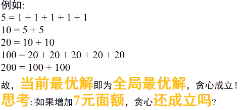

##### 预备知识

* 贪心法  --  钞票支付问题
  * 有1元、5元、10元、20元、100元和200元钞票**无穷多张**。使用这些钞票**支付**X元，**最少**需要多少张？
  * 
  * 直觉：**尽可能多**使用**面值较大**的钞票！
  * 贪心：遵循某种规律，不断**贪心**选取**当前最优**策略的算法设计方法
* 为什么**一定**是对的
  * 任意面额是比自己小的面额的**倍数关系**
  * 在使用一张较大面额钞票时，用**较小面额钞票**替换，一定需要更多**其他面额**钞票!
  * 
  * 

##### 重点例题分析

* 

