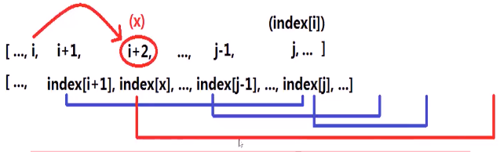

#### 数组存储了非负整型数据，nums[i]代表可以从数组第i个位置最多向前跳跃nums[i]步；是否可以从第0个位置跳跃到最后一个元素的位置？

* 
* 思考
  * 无法**直观**从第0个位置开始依次向后的**跳跃方式**
  * 例如
    * 
  * 难点
    * 如何选择，跳到第一位置还是第二位置？
    * 若选择跳跃到第一位置，之后应该跳到哪个位置？
  * 
* 贪心规律
  * 当前在第i位置，该位置**最远**可以跳到第j个位置（index[i]），故第i位置**还可跳到**第i+1、i+2、...、j-1、j位置
  * 从第i位应**跳到**第i+1、i+2、...、j-1、j位中可以跳到**更远位置的位置**，即index[i+1]、index[i+2]、...、index[j-1]、index[j]**最大**的那个
* 原因
  * 假设该位置为x，index[x]最大，故从位置x出发，可以跳到i+1、i+2、...、j-1、j**所有位置可以达到的最大的位置**；所以跳到位置x**最理想**（多看了一步）
  * 
* 算法思路
  1. 求第i位置**最远可跳到**第index[i]位置：index[i] = nums[i] +i
  2. 初始化
     1. 设置变量jump代表**当前所处**位置，初始化为0
     2. 设置变量max_index代表从第0位置到第jump位置这个**过程中，最远可以达到的位置**，初始化为index[0]
  3. 利用jump扫描index数组，**直到**jump达到index数组尾部或者jump超过max_index，扫描过程中，**更新max_index**
  4. 若最终jump为**数组长度**，则返回true，否则false
     1. 
     2. 
* 代码实现
  * 
  * 