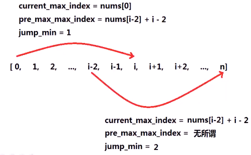
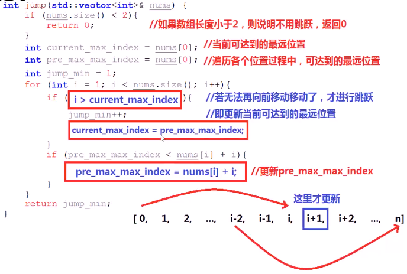

#### 在跳跃游戏1的前提下，保证能跳到最后一个位置，求最少需要跳跃几次

* 
* 思考
  * **最少**跳几次**达到**最后一个位置
  * 若希望**最少跳跃**达到终点，则需要明确**何时进行跳跃**是**最合适**的
  * 
  * 贪心规律
    * **到达某点前**一直不跳跃，发现从该点不能跳到**更远**的地方，在这之前一定有次**必要**的跳跃
    * **结论**：在**无法到达更远**的地方时，在这之前**应该跳到**一个可以到达更远位置的位置
    * 

> 算法思路
>
> 1. 设置current_max_index为**当前可达到的最远位置**
> 2. 设置pre_max_index为**遍历**各个位置的过程中，各个位置**可达到的最远位置**
> 3. 设置jump_min为**最少跳跃次数**
> 4. 利用i遍历nums数组，若i**超过**current_max_index,jump_min加1，current_max_index=pre_max_index
> 5. 遍历过程中，若nums[i]+i(nums[i])**更大**，则更新pre_max_index=nums[i]+i
>    1. 

* 代码实现

  * 

    

