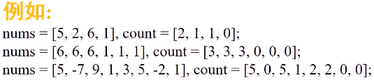
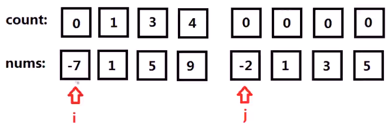
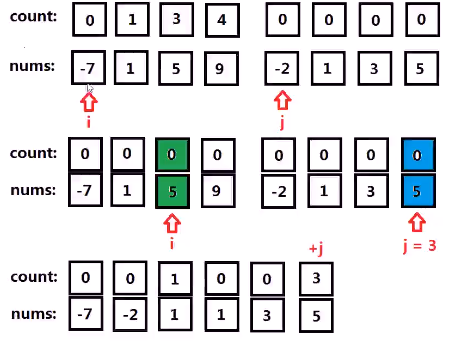
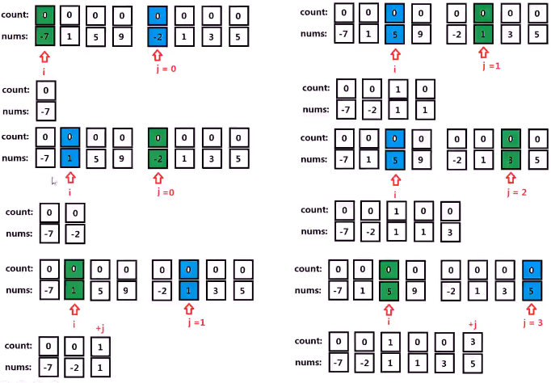
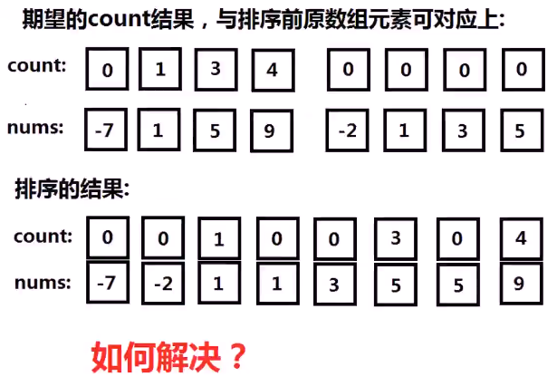
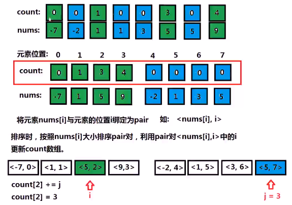
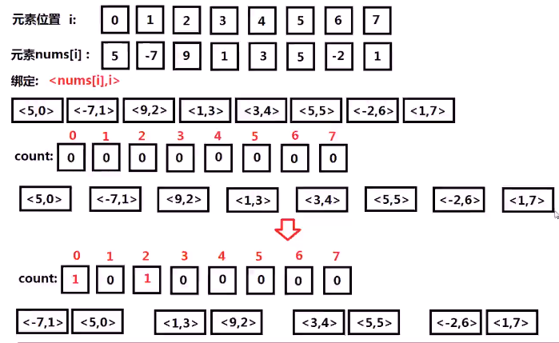
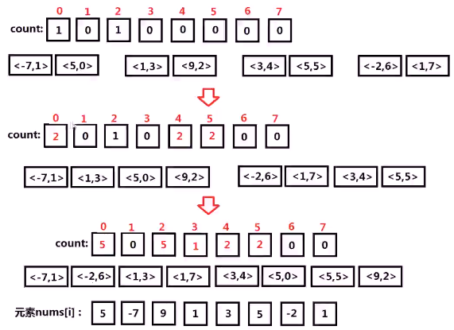
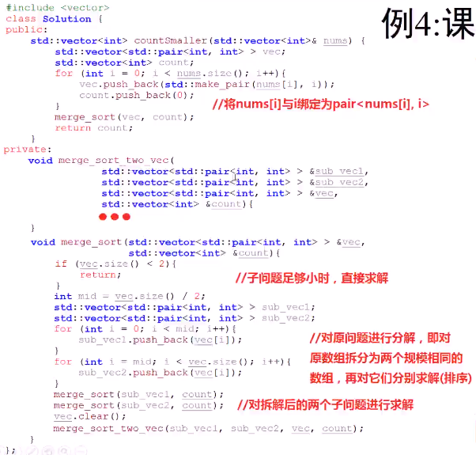
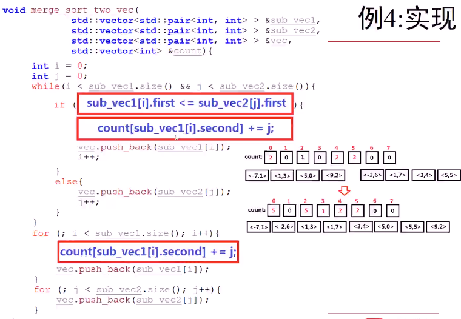

* 已知数组nums，求新数组count，count[i]代表在nums[i]右侧且比nums[i]小的元素个数

*  

* 方法很多：这次用分治法，后面用二叉排序

* 思考

  * 暴力破解：对每个元素扫描右侧比它大的数字，累加个数。假设数组元素个数为n，算法复杂度为O(n^2)0
  * 观察如下数组，若前四个元素有序，后四个也有序，是否有更好方法计算conut数组
    * 
    * 进行归并排序时，需要将前一个数组元素的指针i指向元素插入时，对应的count[i]，就是指向后一个数组的指针j的值
      * 
    * 具体思路
      * 
    * 
    * 
    * 
    * 

* 具体实现

  * 

  * 

    