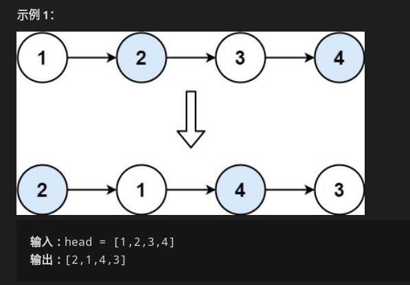

#### 两两交换链表中节点，返回交换后的链表

* 

* 使用递归三部曲解决

  * 找终止条件：本题终止条件很明显，当递归到链表为空或者链表只剩一个元素的时候，没得交换了，自然就终止了。
  * 找返回值：**返回给上一层递归**的值应该是已经**交换完成后的子链表**。
  * 单次的过程：因为递归是重复做一样的事情，所以从宏观上考虑，只用考虑**某一步是怎么完成的**。我们假设待**交换的俩节点分别为head和next**，**next的应该接受上一级返回的子链表**(参考第2步)。就相当于是一个**含三个节点的链表交换前两个节点**，就很简单了，想不明白的画画图就ok。

* ```c++
  class Solution {
  public:
      ListNode* swapPairs(ListNode* head) {
          if(head == NULL || head->next==NULL)
              return head;
          ListNode *next = head->next;
          head->next = swapPairs(next->next);
          next->next = head;
          // 返回已经两个交换好链表的头指针
          return next;
      }
  };
  ```

  

