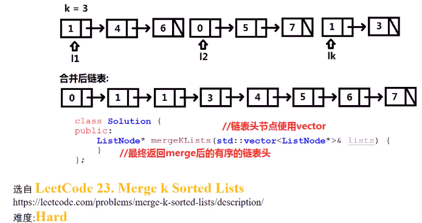
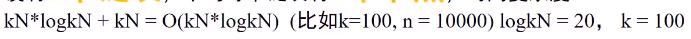
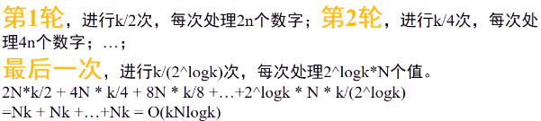
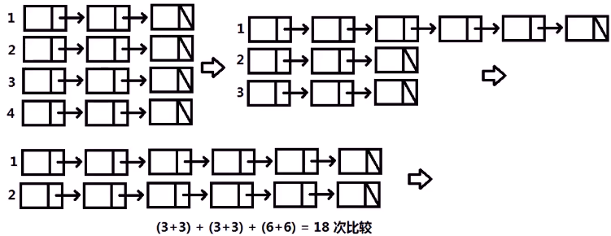
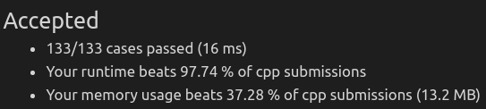

##### 已知`k`个已排序的链表头结点指针，将这`k`个链表合并，合并后仍为有序的，返回合并后的头结点

* 
* 思考
  * 方法一：`k`个链表**按顺序合并**`k-1`次
    * 复杂度爆炸，`O(k^2*n)`
  * 方法二：将`k*n`个节点放在`vector`中，**将`vector`排序**，将**节点顺序相连**
    * 复杂度分析：有`k`个链表，平均每个链表有`n`个节点，时复
  * 方法三：对`k`个链表进行**分治**，**两两进行合并**
    * 有`k`个链表，平均每个链表有`n`个节点，时复：
    * 

* 代码实现

  * 方法二：排序

    * ```c++
      ListNode* mergeKLists(vector<ListNode*>& lists) {
          vector<ListNode *> node_vec;
          for(int i=0;i<lists.size();i++) {
              ListNode *head = lists[i];
              while(head) {
                  node_vec.push_back(head);
                  head = head->next;
              }
          }
          if(node_vec.size() == 0)
              return nullptr;
          sort(node_vec.begin(),node_vec.end(),[](const ListNode *a,const ListNode *b){return a->val < b->val;});
          for(int i=1;i<node_vec.size();i++)
              node_vec[i-1] -> next = node_vec[i];
          node_vec[node_vec.size()-1] -> next = nullptr;
          return node_vec[0];
      }
      ```

    * 

  * 方法三：分治

    * ```c++
      ListNode* mergeTwoLists(ListNode* l1, ListNode* l2) {
          ListNode temp_head(0);         // 临时头结点
          ListNode *pre = &temp_head;
          while(l1&&l2) {
              if(l1->val < l2->val) {
                  pre -> next = l1;
                  l1 = l1 -> next;
              }
              else {
                  pre -> next = l2;
                  l2 = l2 -> next;
              }
              pre = pre->next;     // pre指向新连的节点
          }
          if(l1) pre->next = l1;   // 当l1有剩余，将l1接在pre后面
          if(l2) pre->next = l2;
          return temp_head.next;
      }
      
      // 分治
      ListNode* mergeKLists(vector<ListNode*>& lists) {
          if(lists.size() == 0) return nullptr;
      
          if(lists.size() == 1) return lists[0];
      
          // 调用合并两个有序链表的方法
          if(lists.size() == 2) return mergeTwoLists(lists[0],lists[1]);
      
          int mid = lists.size()/2;
      
          vector<ListNode*> sub1_lists;
          vector<ListNode*> sub2_lists;
          for(int i = 0;i<mid;i++)
              sub1_lists.push_back(lists[i]);
          for(int i=mid;i<lists.size();i++)
              sub2_lists.push_back(lists[i]);
          ListNode *l1 = mergeKLists(sub1_lists);
          ListNode *l2 = mergeKLists(sub2_lists);
      
          return mergeTwoLists(l1,l2);
      }
      ```

    * 

