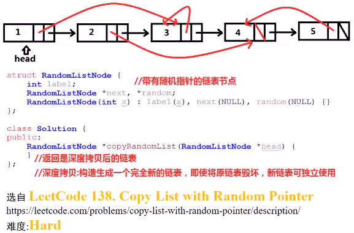
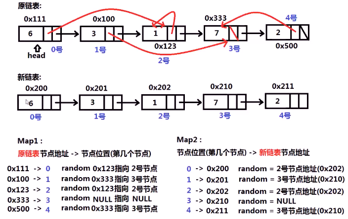

##### 已知一个复杂的链表，节点中有一个指向本链表任意某个节点的随机指针（也可以为空），求这个链表的深度拷贝

* 

* 思考：**节点地址和节点序号对应**  `MAP映射`

  * 

  * ```c++
    Node* copyRandomList(Node* head) {
        map<Node*,int> node_map; // 地址到节点位置的映射
        vector<Node *> node_vec; // 利用vector存储节点位置访问地址
        Node *ptr = head;
        int i=0;
        while(ptr) {
            // 深度拷贝，需要申请空间
            node_vec.push_back(new Node(ptr->val));
            node_map[ptr] = i;
            ptr = ptr -> next;
            i++;
        }   // 记录节点位置
        node_vec.push_back(0);
        ptr = head;
        i= 0;     // 再次遍历原始列表，给next指针，random指针赋值
        while(ptr) {
            // 连接新链表next
            node_vec[i] -> next = node_vec[i+1]; 
            if(ptr->random) {
                int id = node_map[ptr->random];  // 找到其指id
                node_vec[i] -> random = node_vec[id];
            }
            ptr = ptr->next;
            i++;
        }
        return node_vec[0];
    }
    ```

  * 