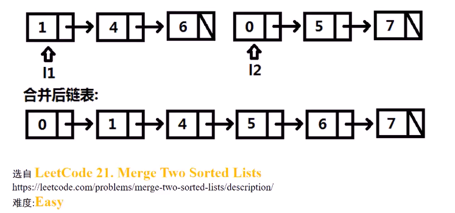
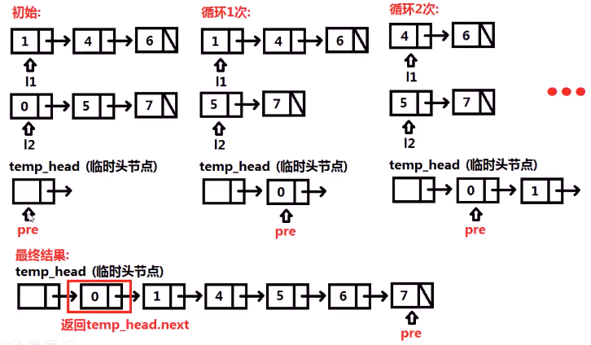

##### 已知两个已排序链表头节点指针`l1`和`l2`，将这两个链表合并，合并后仍是有序的，返回合并后的头节点

* 

* 思考

  * 比较`l1`和`l2`指向的节点，将较小的节点插入到`pre`指针后，并**向前移动**较小节点对应的指针

  * 

  * ```c++
    // 添加一个临时头结点，让问题变得简单
    ListNode* mergeTwoLists(ListNode* l1, ListNode* l2) {
        ListNode temp_head(0);         // 临时头结点
        ListNode *pre = &temp_head;
        while(l1&&l2) {
            if(l1->val < l2->val) {
                pre -> next = l1;
                l1 = l1 -> next;
            }
            else {
                pre -> next = l2;
                l2 = l2 -> next;
            }
            pre = pre->next;     // pre指向新连的节点
        }
        if(l1) pre->next = l1;   // 当l1有剩余，将l1接在pre后面
        if(l2) pre->next = l2;
        return temp_head.next;
    }
    ```

    * 