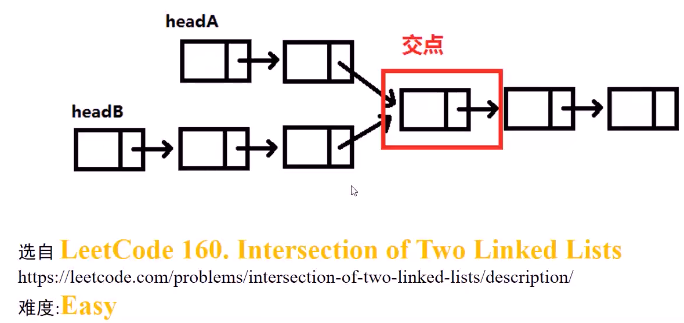
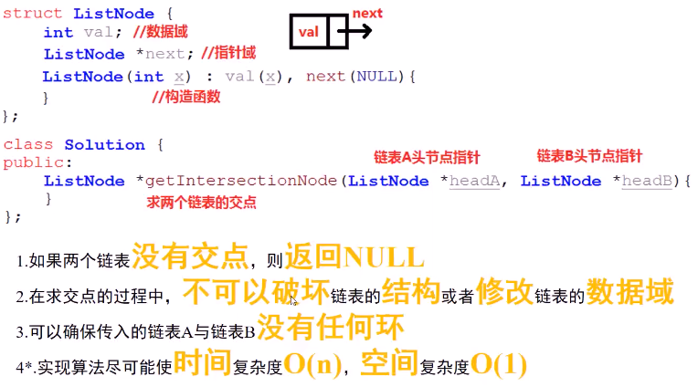
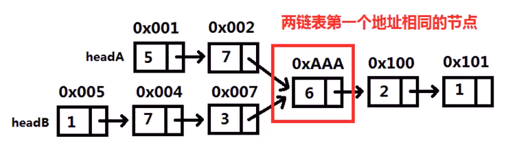
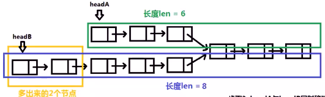
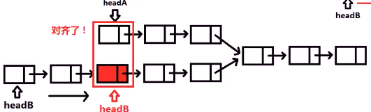
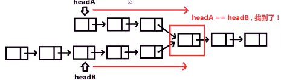

##### 已知链表`A`的头节点指针`headA`，链表`B`的头节点`headB`，两个链表相交，求两链表交点

* 
* 

* 思考 

  * 方法`1`：`set`集合求交集

    * 遍历链表`A`，将`A`中节点对应的**指针（地址）**，插入`set`

    * 遍历链表`B`，将`B`中节点对应的**指针（地址）**，在`set`中查找

      * 发现在`set`中第一个节点地址，就是两个链表的交点
      * 

    * ```c++
      // set求交集
      ListNode *getIntersectionNode(ListNode *headA, ListNode *headB) {
          set<ListNode*> node_set;
          while(headA) {
              node_set.insert(headA);
              headA =headA -> next;
          }
          while(headB) {
          if(node_set.find(headB)!= node_set.end())
          	return headB;
              headB = headB -> next;
          }
          return nullptr;
      }
      ```

    * 

  * 方法`2`：

    * 计算`headA`和`headB`链表长度，还有较长链表多出的长度

      * 

    * 将较长链表的指针**移动**到和较短链表指针**对齐**的位置

      * 

    * `headA`和`headB`同时移动，当两指针**指向同一个节点**时，就**找到相交节点**

      * 

    * ```c++
      int get_list_length(ListNode* head) {
          int len = 0;
          while(head) {
              len++;
              head = head->next;
          }
          return len;
      }
      
      ListNode* forward_long_list(int long_len,int short_len,ListNode* head) {
          int delta = long_len - short_len;
          while(head&&delta) {
              head = head -> next;
              delta --;
          }
          return head;
      }
      
      // 遍历两个链表，找到较长的多较短的多少个，遍历到相同长度一起往后遍历
      ListNode *getIntersectionNode(ListNode *headA, ListNode *headB) {
          int list_A_len = get_list_length(headA);
          int list_B_len = get_list_length(headB);
          if(list_A_len > list_B_len) 
              headA = forward_long_list(list_A_len,list_B_len,headA);
          else headB = forward_long_list(list_B_len,list_A_len,headB);
          while(headA&&headB) {
              if(headA == headB)
                  return headA;
              headA = headA -> next;
              headB = headB -> next;
          }
          return nullptr;
      }
      ```

    * 

