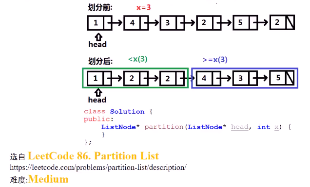
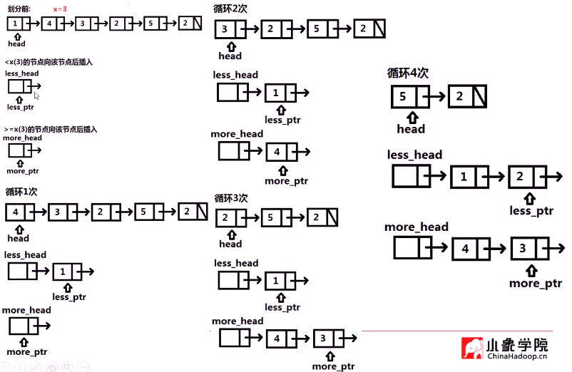
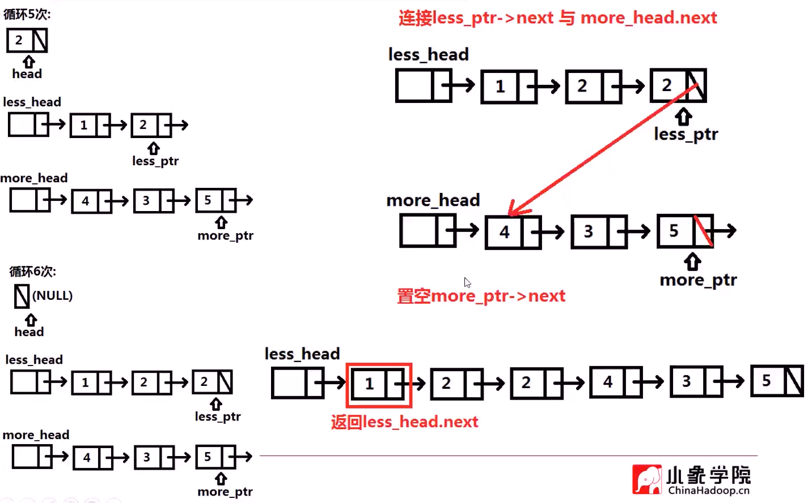

##### 已知链表头指针`head`与数值`x`，将所有小于`x`的节点放在大于或等于`x`的节点前，且保持这些节点的原来的相对位置

* 

* 思路：利用临时头结点

  * 

  * 

  * 小于的放一个链表，大于的放一个链表，最后连接两个链表

  * ```c++
    ListNode* partition(ListNode* head, int x) {
            ListNode less_head(0);  // 设置两个临时头结点
            ListNode more_head(0);
            ListNode *less_ptr = &less_head;
            ListNode *more_ptr = &more_head;   // 对应指针指向两个头
            while(head) {
                if(head->val < x) {
                    less_ptr -> next = head;
                    less_ptr = head;
                }
                else {
                    more_ptr -> next = head;
                    more_ptr = head;
                }
                head = head ->next;
            }
            // 最后置空more_ptr->next
            more_ptr -> next = nullptr;
            // 将less链尾和more链头相连
            less_ptr -> next = more_head.next;
            return less_head.next;
        }
    ```

* 

