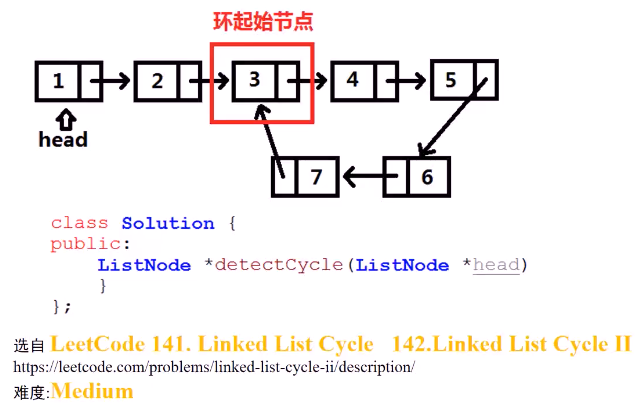
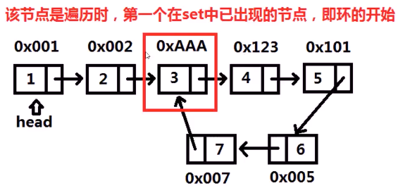
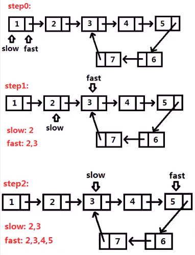
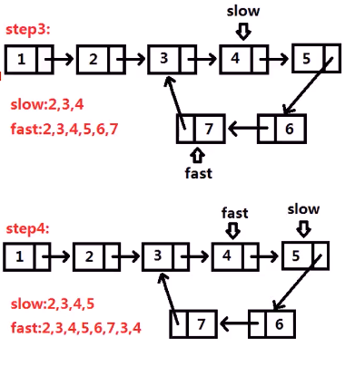
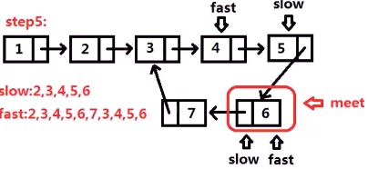
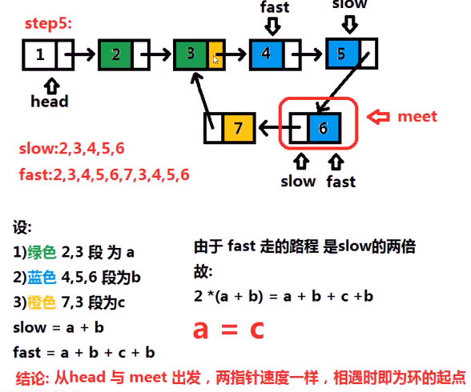

##### 已知链表中可能存在环，若有环则返回环起始节点，否则返回NULL

* 

* 思考

  * 方法一：使用`set`求环起始节点

    * 遍历节点，将**链表中**节点对应的**指针（地址）**，**插入`set`**

    * 在遍历时**插入节点前**，需要在`set`中**查找**，**第一个**在`set`中发现的节点地址，就是链表环的**起点**

    * 

    * ```c++
      bool hasCycle(ListNode *head) {
          set<ListNode*> node_set;
          while(head) {
              if(node_set.find(head) != node_set.end()) 
                  return head;
              node_set.insert(head);
              head = head -> next;
          }
          return false;
      }
      ```

    * 

  * 方法二：快慢指针赛跑

    * 长跑，跑的快 的人 超过一圈 跑的慢的
      * 快指针每次走两步，慢指针每次走一步
      * **有环，那么一定会相遇，但其不一定是环的起始位置**
    * 
    * 
    * 
    * 

> * 快指针走的路程是满指针路程两倍
>   * 速度两倍，时间一样（`S=vt`）
> * 超圈
>   * 快的肯定在慢的前面，只有当快的领先慢的一圈时候，才可能相遇
>   * 最后两个路程相等，是由方程式推算的

* ```c++
  // 快慢指针
  bool hasCycle(ListNode *head) {
      ListNode *fast = head;
      ListNode *slow = head;
      ListNode *meet = nullptr;
      while(fast) {
          slow = slow->next;
          fast = fast->next;
          if(!fast) return false;  // 遇到链表尾部，无环
          fast = fast -> next;     // fast再走一步
          if(fast == slow) {       // 快慢指针相遇
              meet = fast;         // 记录相遇节点
              break;             
          }
      }
      if(meet == nullptr)          // 没有相遇，同样无环
          return false;
      while(head&&meet) {
          if(head == meet) 
              return true;
          head = head ->next;     // 每次走一步
          meet = meet -> next;
      }
      return false;
  }
  ```

* 

