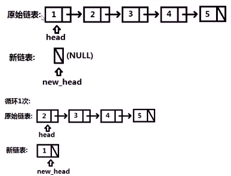
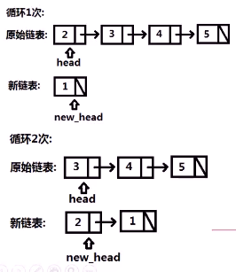
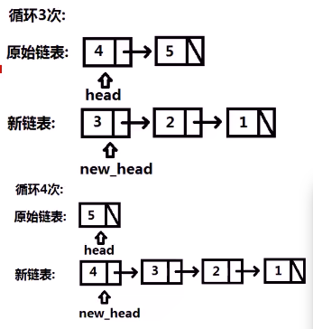
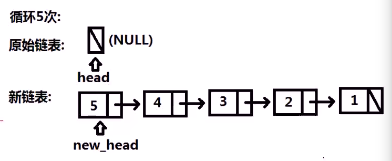
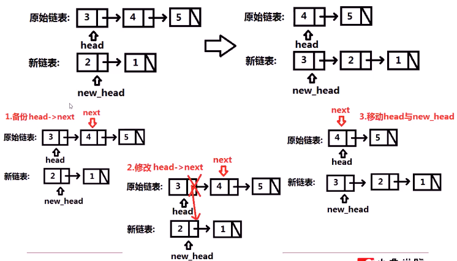

#### 给定单链表的头结点head，返回反转后链表头指针

* `input: 1->2->3->4->5->nullptr`

* `output: 5->4->3->2->1->nullptr`


* 思路
  * **依次遍历**链表节点，每遍历一个节点就**逆置**一个节点
    * 
    * 
    * 
    * 
  * 

* 代码实现

  * ```c++
    ListNode* reverseList(ListNode* head){
        ListNode *new_head = NULL;
        while(head) {
            ListNode *next = head->next;
            head->next = new_head;
            new_head = head;
            head = next;
        }
        return new_head;
    }
    ```

  * 


