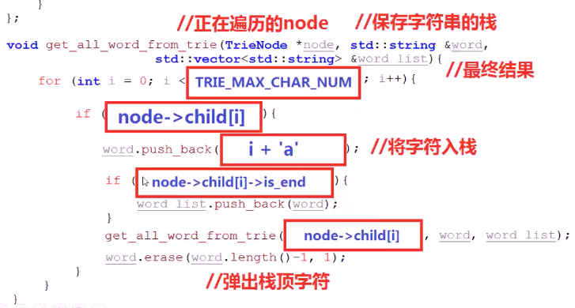

#### 前缀树/字典树

> 
>
> 主要用于**统计、存储**和排序**字符串**
>
> 功能与**hash表**类似
>
> **前序遍历**后输出**字典序**
>
> 关键字存储在**路径**中
>
> 一个节点的**所有子孙**有**相同的前缀**
>
> 不一定叶节点是字符串结尾，也有内部节点为结尾
>
> 优点：利用字符串**公共前缀**减少存储空间和查询时间，最大限度**减少**无谓字符串**比较**

* 节点表示
  * 
  * 记录单词是否存储在树中
    * 指针数组（孩子指针）
    * 标记是否为字符串结尾
* eg：构造Trie树
  * 
* 字典序的生成方式：前序遍历
  * 

* Trie获取全部单词
  * **深度**搜索Trie树，对于**正在**搜索的节点node
  * **遍历**该节点的26个孩子指针child[i] ('a'-'z')，若**指针不空**
    * 将该child[i]对应的字符(i+‘a’)，**push进入栈**中
    * 若孩子**指针标记**的is_end为真（说明该位置是一个单词）
      * 从**栈底到栈顶**对栈进行遍历，生成字符串，将它保存到结果数组中
    * 深度搜索child[i]
    * 弹出栈顶字符
  * 
    * 
    * 
  * 代码实现
    * 

* Trie的整体功能
  * 将字符串插入到树中
    * 使用ptr指针**指向**root
    * **逐个遍历**待插入的字符串中的各个字符
      * 计算**下标pos** = **正在遍历字符** - 'a'
      * 若ptr指向节点的**第pos个孩子**为假
        * **创建**该节点的第pos个孩子
      * ptr**指向**该节点的第pos个孩子
    * **标记**ptr指向的节点is_end为true
    * 
    * 代码实现
      * 
  * 搜索树中是否存在字符串
    * 使用prt指针**指向**root
    * **逐个遍历**待搜索的字符串中的**各个字符**
      * 计算**下标pos** = **正在遍历字符** - 'a'
      * 若ptr指向的节点的**第pos个孩子**为假
        * 返回假
      * ptr**指向**该孩子的第pos个孩子
    * **返回ptr**指向的节点的is_end
    * 
    * 代码实现
      * 
  * 确定树中是否有前缀为prefix的单词
    * 
  * 

