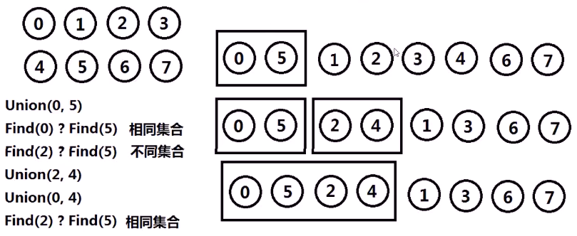
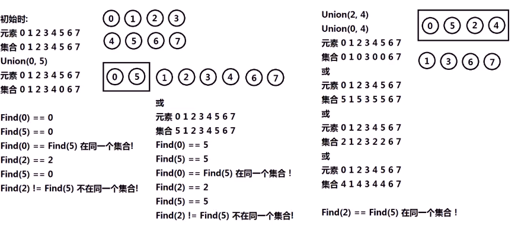
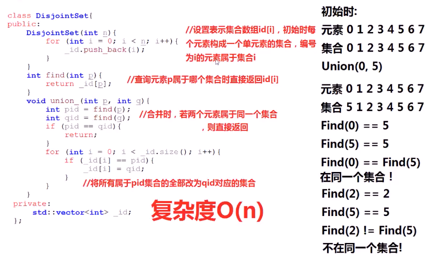
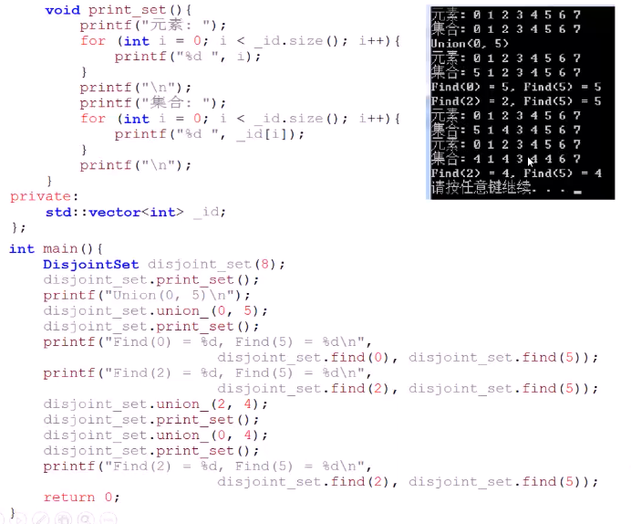
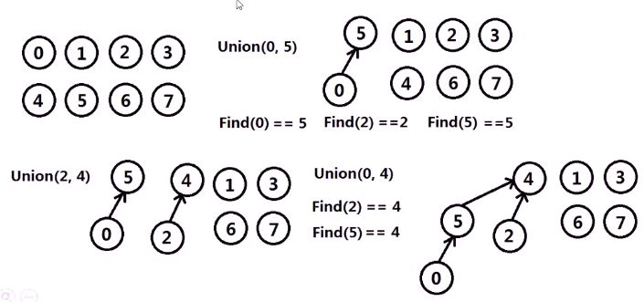
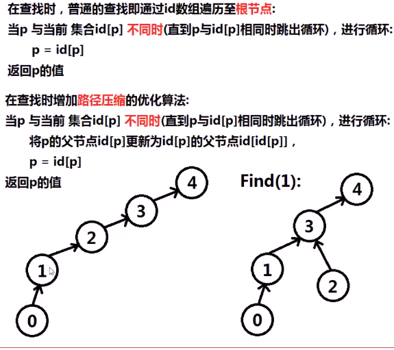
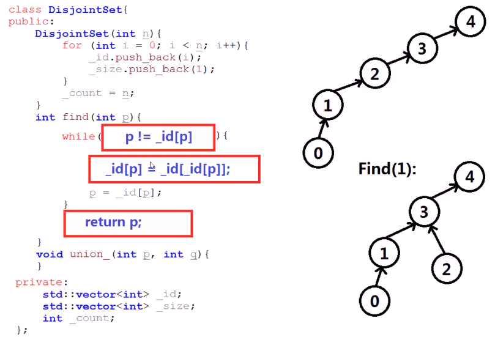
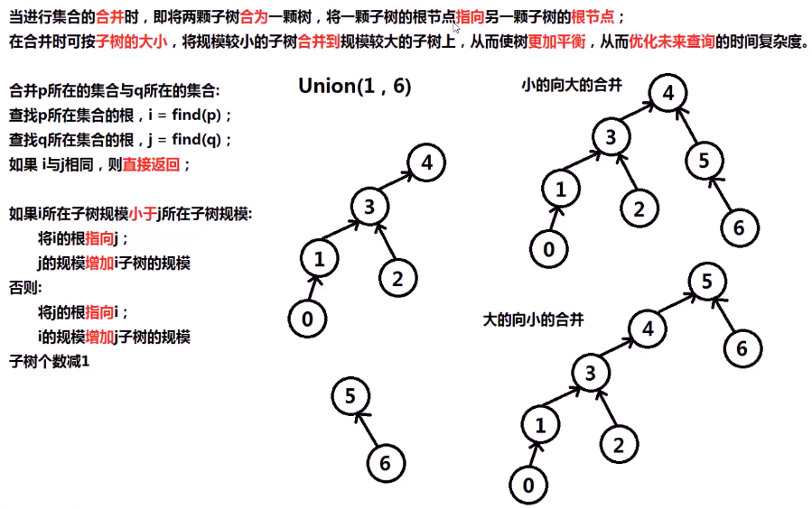
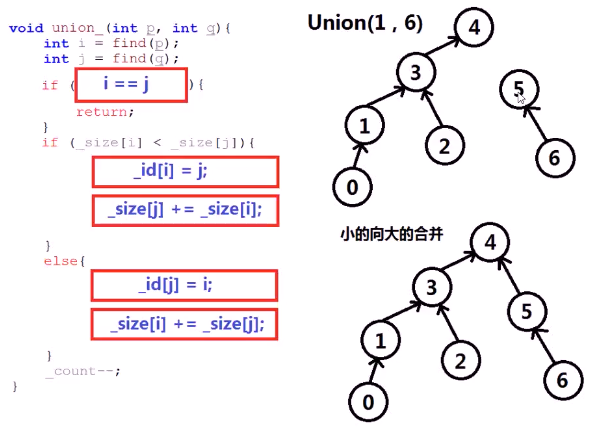

#### n个元素求并与查询

> 开始时：
>
> 每个元素构成一个单元素集合
>
> 按照**一定顺序**将属于**同一组**的元素所在的集合**合并**，其间要**反复查找**一个元素在哪个集合中。面对**极大的数据量**，能够解决问题。

* 
* 功能分析
  * 
* 数组实现并查集
  * 
* 测试
  * 

* 森林实现并查集

  * **森林**存储集合之间的关系，属于**同一集合**的**不同元素**，都有一个**相同的根节点**，代表这个集合

  * 进行查找某元素属于哪个集合时，就是遍历该元素到**根节点**，返回**根节点**代表的集合；在遍历过程中使用**路径压缩**的优化算法，使整体树的形状**更加扁平**，从而优化**查询时间复杂度**

  * 进行**合并**时，就将两颗子树**合并为**一棵树，将一颗子树的根节点**指向**另一颗子树的根节点；在合并时可按子树的**大小**，将规模小的子树**合并到**规模大的子树上，从而使得树的规模**更加平衡**，继而优化未来**查询**的时间复杂度

  * 

  * 查找算法

    * 
    * 
      * 进行了路径压缩

  * 合并算法

    * 
    * 

    

