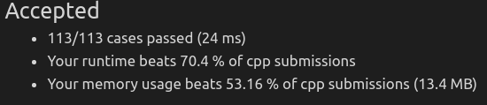

#### N个同学，有些是朋友，有些不是。“友谊”可以传递，A和B是朋友，B和C是朋友，那么A和C也是朋友（扯淡）。朋友圈是完成友谊传递之后的一组朋友。

> 给定NxN矩阵，代表同学间是否为朋友，若M[i] [j] = 1代表第i个学生与第j个学生是朋友，否则不是。求朋友圈的个数

* 

* 方法1：DFS
  * 求图中**多少**区域**相连**，使用图的**深搜**或**广搜**
  * 与岛屿数量有何类似
  * 
  * 
* 方法2：并查集
  * 传入代表**朋友友谊**的二维数组M
  * 设置并查集，大小为M.size()
  * 对任意两个学生i,j，若之间**存在友谊**（M[i] [j] == 1），则将他们进行**合并**
  * 放回并查集**集合个数**
  * 
  * 代码实现
    * 
    * 
    * 