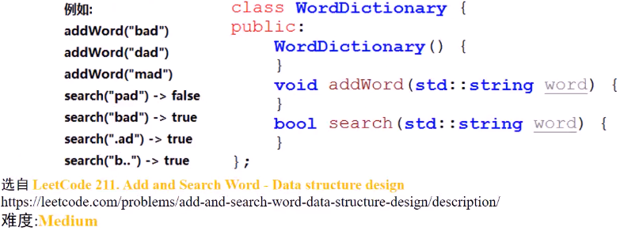
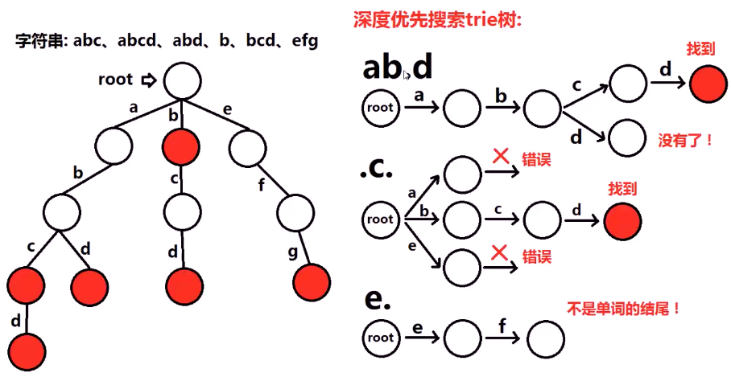
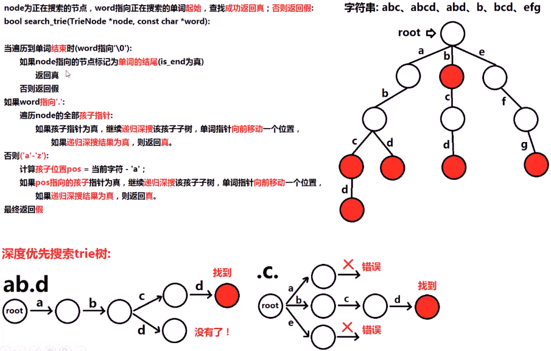
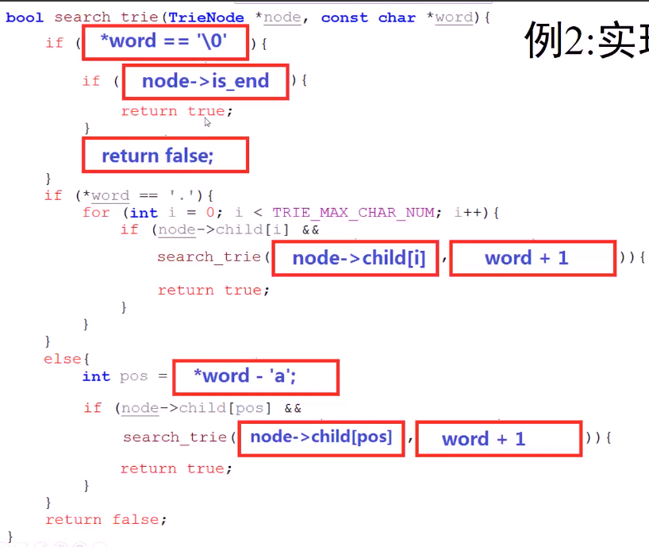

#### 设计数据结构，支持两个操作

> 1> 添加单词：addWord(word)
>
> 2> 搜索单词：bool search(word)
>
> ps：搜索时，按照**普通方式**搜索（原始单词），或**正则表达式的方法**搜索；添加的单词**只包含小写字符**'a'-'z'；搜索时，只包含小写字符‘a’-'z'或'.'。'.'代表**任意一个小写字符**

* 

* 插入操作完全一致
* 思考搜索的时候怎么处理 .匹配一个字符
  * 
  * 思路
    * 
  * 代码实现
    * 

